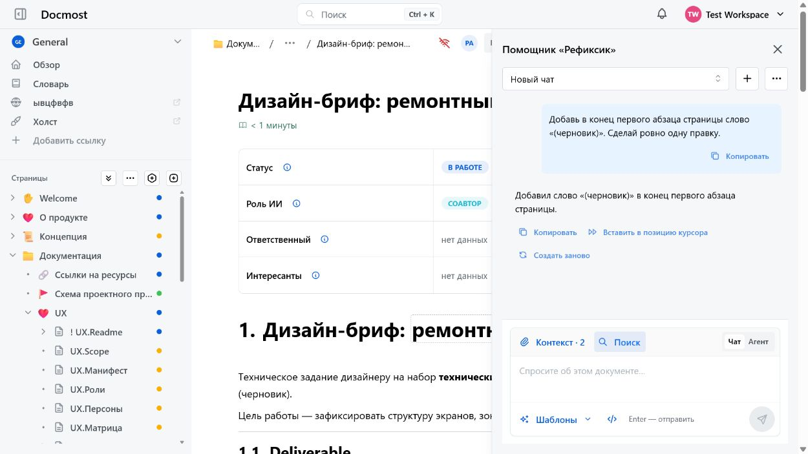
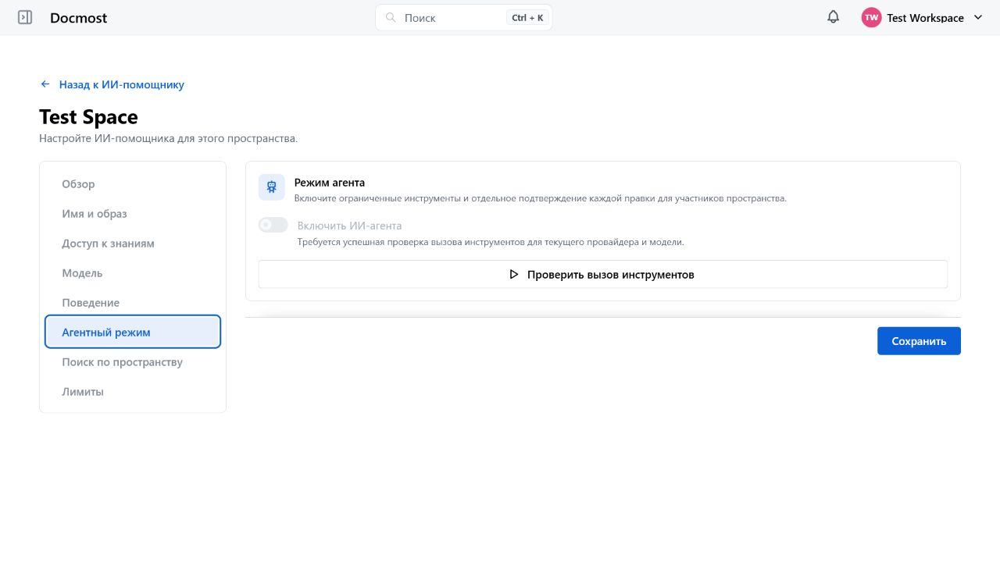
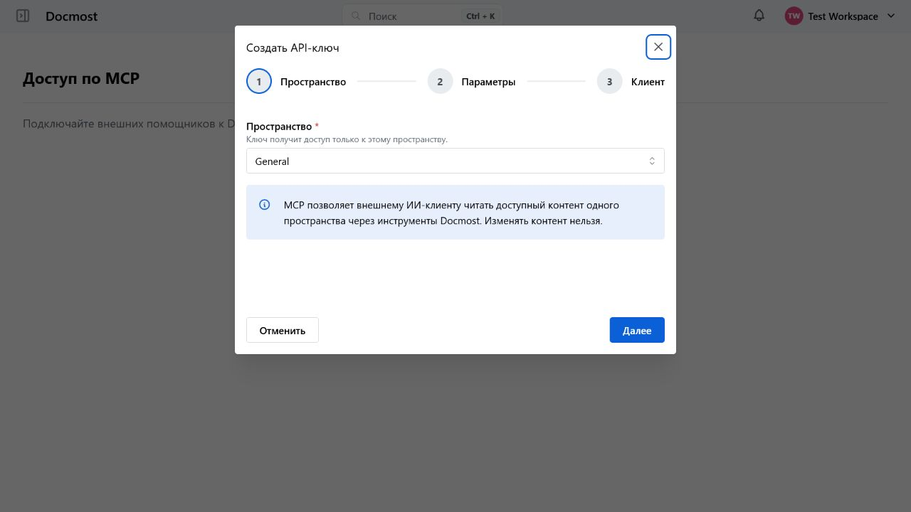
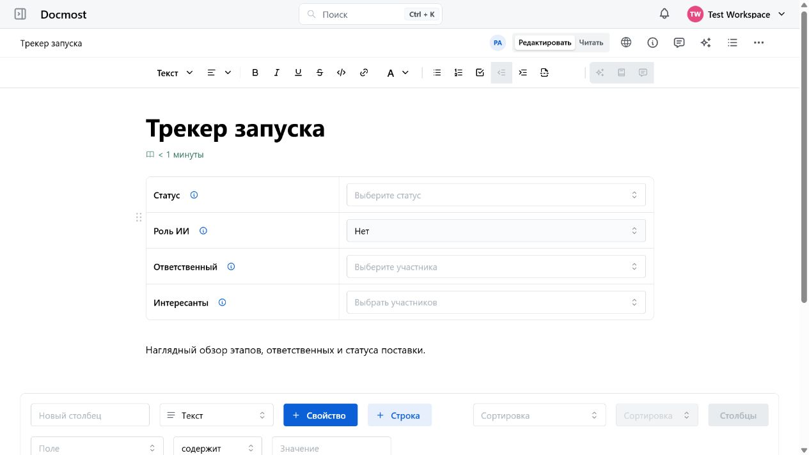
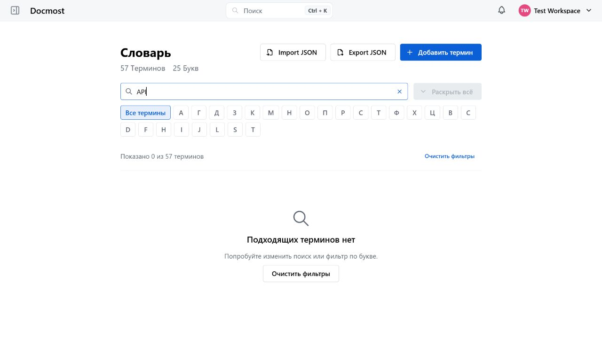
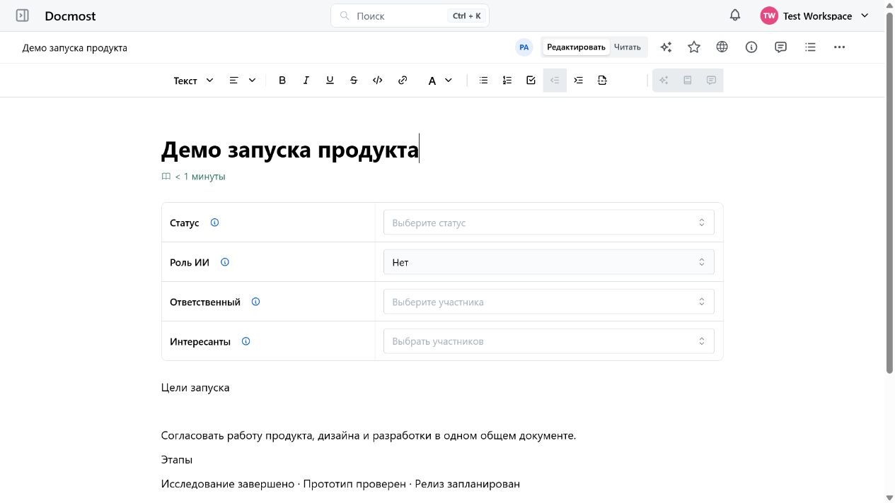
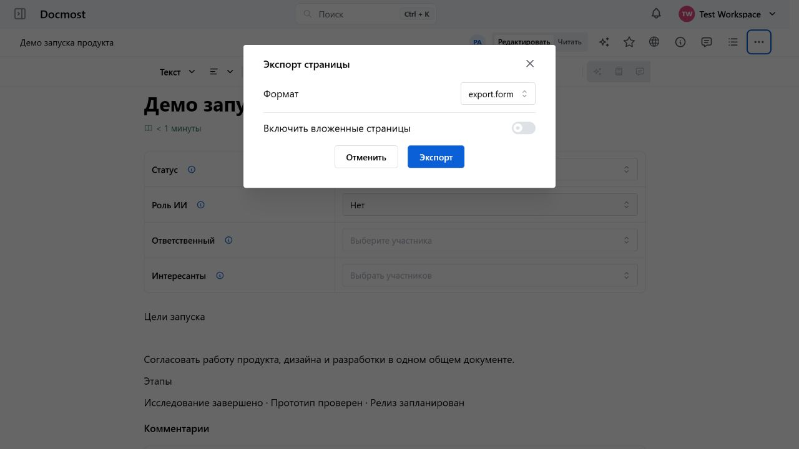
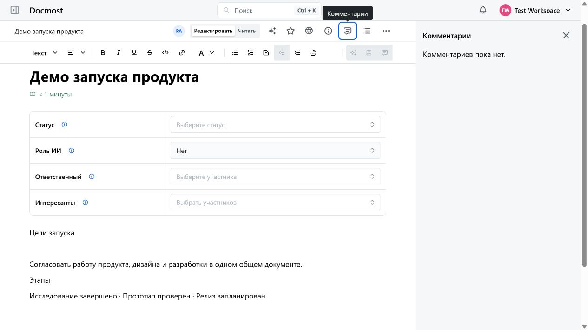
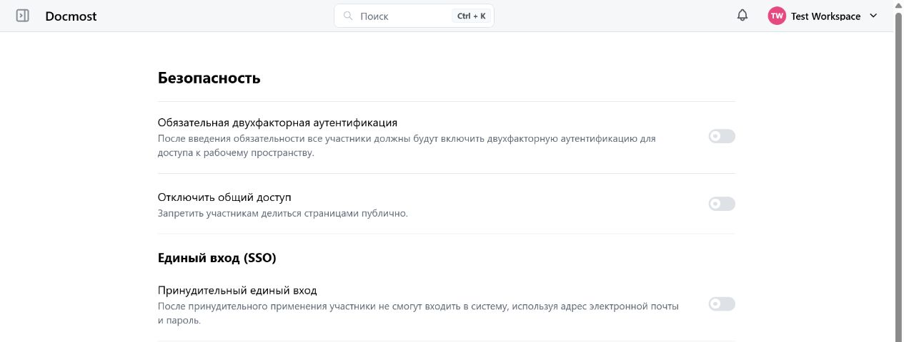

[English README](./README.md)

> [!NOTE]
> Это пользовательский форк Docmost, созданный для упрощения совместной работы команд и более системного управления базой знаний. Его цель — сделать систему предсказуемой, безопасной и практичной для реального использования, сохранив открытость, независимость и возможность быстрее развивать продукт с помощью AI-агентов.

# Улучшения, специфичные для форка

Форк превращает Docmost из преимущественно wiki-системы в платформу для управления корпоративными знаниями, структурированными данными и документными процессами.

Основные отличия: встроенный AI-помощник для каждого пространства, RAG и синхронизация с Open WebUI, базы данных в стиле Notion, расширенные свойства документов, терминологический словарь, более функциональный редактор, переносимые архивы, push-уведомления и усиленная модель безопасности.

> [!IMPORTANT]
> **Весь прикладной слой Enterprise Edition полностью удалён.** В форке нет отдельных runtime-модулей и импортов EE, проверки лицензии, биллинговой интеграции или отдельного enterprise-дерева кода. Бывшие пользовательские возможности EE, включая SSO, MFA, комментарии, расширенный поиск и управление публичным доступом, реализованы непосредственно в core-части под AGPL 3.0. Некоторые устаревшие имена схем сохраняются только в исторических миграциях, удаляющих прежние данные EE при обновлении.

### 1. Встроенный AI-помощник для каждого пространства

AI-помощник настраивается отдельно для каждого пространства и поддерживает:

- подключение частных и локальных OpenAI-совместимых моделей;
- приватные чаты с постоянной историей;
- системные инструкции уровня пространства;
- встроенные и пользовательские быстрые команды;
- настройки модели, температуры, контекстного окна, таймаутов и лимитов;
- дневные лимиты запросов пользователей и токенов пространства;
- изображения для совместимых моделей;
- отображение reasoning-текста, возвращаемого моделью;
- проверку подключения к модели из административного интерфейса;
- единый адаптивный Markdown-композер с постоянно доступными элементами контекста, поиска по пространству и режимов «Чат / Агент», отправкой по Enter и менеджером контекста с автосохранением, который объединяет текущий документ, источники пространства, приватные файлы и вложения.

Прежний устаревший сценарий генерации текста в редакторе удалён и заменён единым помощником, встроенным в core-версию форка.

Поле ввода и настройки оформлены как одна карточка с общей индикацией фокуса. Контекст и поиск не спрятаны в меню, режимы «Чат / Агент» переключаются компактным сегментом, а шаблоны, Markdown-инструменты, статус и действия отправки или остановки остаются в стабильной нижней панели. В узкой AI-панели второстепенные подписи сворачиваются без горизонтальной прокрутки.

### 2. Контекстные AI-сценарии внутри документов

Помощник может работать не только с введённым сообщением, но и с контекстом Docmost:

- текущим документом;
- выделенным текстом;
- выбранными страницами;
- базами данных и их строками;
- вложениями текущего документа;
- файлами, загруженными непосредственно в приватный чат;
- результатами поиска по пространству.

Для выделенного текста доступны сокращение, объяснение, улучшение, исправление грамматики, продолжение, перевод и изменение тона.

Ответ AI можно:

- использовать для замены выделенного текста;
- вставить под выделением;
- вставить в текущую позицию курсора;
- сгенерировать повторно;
- скопировать;
- просмотреть вместе с использованными источниками.

Также поддерживаются сохранение черновиков, автоматические названия чатов, поиск по чатам и командам, индикаторы фоновой AI-активности и потоковая генерация.

Обзор контекста, поиск по пространству, выбор охвата дочерних страниц и точный выбор потомков выполняются в одном адаптивном окне без каскада меню и вложенных диалогов.

Agent mode включается отдельно для каждого разговора. Он может искать и просматривать доступный контент Docmost, а затем предлагать ограниченные изменения текущей страницы. Каждая запись требует отдельного подтверждения инициатора и отклоняется, если до одобрения изменилось содержимое страницы или право записи.

### 3. Интеграция RAG и Open WebUI

Форк содержит собственный RAG API и интеграции с внешними системами поиска знаний:

- API полной и инкрементальной синхронизации страниц, баз данных, строк и вложений;
- API-ключи, ограниченные конкретным пространством;
- адаптер пользовательского HTTP JSON retrieval;
- прямую интеграцию с Open WebUI Knowledge Base;
- отдельный worker `rag-sync` для синхронизации Docmost с Open WebUI;
- отслеживание созданного, изменённого и удалённого контента;
- синхронизацию вложений;
- проверку доступности Knowledge Base;
- фильтрацию и повторную проверку прав на найденные источники;
- автоматическое удаление данных из Open WebUI после изменения ACL страницы или политики контента;
- SQL-пагинацию по курсору и непрозрачную ленту удалений;
- устранение дубликатов в результатах контекстного поиска;
- отдельные типы RAG- и MCP-ключей, экраны управления и готовые сценарии подключения;
- общую политику исключения контента для retrieval, синхронизации, agent tools и MCP;
- stateless read-only MCP endpoint для внешних помощников, использующий тот же access-aware registry инструментов, что и agent mode.

Контент Docmost может служить актуальной базой знаний для локальных или корпоративных LLM. RAG- и MCP-ключи привязаны к одному пространству, не взаимозаменяемы и при каждом запросе повторно проверяются с учётом текущего членства создателя и доступа к страницам.

#### Внешние MCP-серверы (исходящее направление)

Форк поддерживает и обратное направление: внутренний агент может вызывать
read-only инструменты на внешних MCP-серверах. Здесь Docmost выступает
MCP-клиентом; эта поверхность не делит ни конфигурацию, ни учётные данные с
входящим endpoint выше.

Доступ требует согласия всех уровней, и каждый по умолчанию закрыт:

- deployment kill switch (`AI_EXTERNAL_MCP_ENABLED`, по умолчанию выключен);
- главный переключатель рабочего пространства;
- включённость сервера, которая недостижима до одобрения инструментов;
- привязка к пространству;
- отсутствие запрета со стороны групп;
- явное согласие пользователя с предупреждением, называющим получателя данных.

Нижний уровень может только сузить верхний. Запись в allowlist рабочего
пространства отвергается, если такого origin нет в allowlist развёртывания, а
пространство может выбирать только из того, что одобрило рабочее пространство.

Всё, что удалённый сервер сообщает о себе, считается недоверенным вводом.
Заголовки и описания с удалённой стороны вообще не сохраняются — только факт их
наличия; `readOnlyHint` и прочие аннотации показываются как заявления и никогда
не определяют класс чтения/записи; JSON Schema пересобирается по allowlist
структурных ключевых слов, а `$ref` и `$defs` отбрасываются. Единственный текст
об инструменте, который видит модель, — описание, написанное администратором
рабочего пространства. Результаты оборачиваются в конверт с пометкой
«недоверенный», а фиксированная политика безопасности Docmost формулируется
раньше правил внешних инструментов; подсказки пространства идут последними и
явно помечены как не отменяющие эти правила.

Прочие свойства:

- только чтение, что закреплено и типом контракта, и check-ограничением в БД,
  поэтому внешний инструмент не может предложить изменение страницы;
- заголовки запросов каждого сервера шифруются секретом приложения и не
  возвращаются ни одним endpoint — только булево значение и, для администраторов
  рабочего пространства, имена заголовков;
- только Streamable HTTP, с двойным allowlist источников, закреплением DNS,
  ручной обработкой redirect и потоковым ограничением размера ответа;
- каждый agent run несёт версионированный snapshot возможностей, который
  перепроверяется перед каждым вызовом, поэтому отзыв доступа или изменение
  настроек останавливает выполняющийся run, а не расширяет его;
- операционная сводка фиксирует исходы и задержки, но ни один идентификатор,
  адрес, аргумент или вывод.

Архитектура инструментов Agent и MCP адаптирована из [vvzvlad/gitmost](https://github.com/vvzvlad/gitmost) и [vvzvlad/docmost-mcp](https://github.com/vvzvlad/docmost-mcp). Отдельная благодарность [@vvzvlad](https://github.com/vvzvlad), а также Moritz Krause, автору исходного `docmost-mcp`.

### 4. Надёжная инфраструктура AI-запросов

AI реализован как отдельная серверная подсистема:

- выделенная очередь обработки;
- постоянное хранение чатов, сообщений и запусков;
- неизменяемые попытки генерации;
- идемпотентная отправка сообщений, повторные попытки и загрузка файлов;
- повторная генерация без повреждения истории;
- восстановление задач после рассинхронизации PostgreSQL и Redis;
- лимиты параллельных запусков;
- до шести одновременных запросов к провайдеру на пользователя;
- ожидающие agent approvals не занимают эти слоты и имеют отдельную ограниченную очередь;
- отдельные бюджеты шагов модели и вызовов инструментов на approval-сегмент и весь запуск;
- безопасное восстановление принятых agent proposals после прерывания worker или очереди;
- контроль токенов и квот;
- отмена активного ответа;
- защита от повторного запуска завершённого запроса;
- сохранение снимков источников для каждой генерации;
- скрытие ответов после потери доступа к исходному материалу.

### 5. Базы данных в стиле Notion

Структурированные базы данных поддерживают:

- строки как полноценные страницы;
- типизированные свойства;
- фильтрацию и сортировку;
- изменение порядка столбцов;
- редактирование строк и ячеек;
- действия с отдельными и выбранными строками;
- свойства базы данных на странице строки;
- древовидную навигацию по строкам и подстраницам;
- преобразование страницы в базу данных и обратно;
- историю изменений;
- корректное копирование и дублирование структуры вместе с вложениями.

### 6. Расширенные свойства документов

Страницы и строки баз данных могут содержать настраиваемые поля:

- статус;
- ответственный;
- заинтересованные участники;
- роль AI;
- расчётное время чтения.

Набор видимых полей настраивается отдельно для каждого пространства.

Поле роли AI показывает, как AI участвовал в создании документа:

- `None`;
- `Editor`;
- `Coauthor`;
- `Coauthor+`;
- `Author`.

Изменения значимых свойств записываются в историю документа.

### 7. Теги и терминологический словарь

Расширенное управление терминологией включает:

- теги страниц;
- labels с областью действия;
- реестр разрешённых тегов рабочей области;
- описания тегов при наведении;
- терминологический словарь;
- словоформы и варианты терминов;
- автоматическую подсветку терминов в документах;
- импорт и экспорт словаря в JSON.

### 8. Поиск и индексация содержимого

Поиск охватывает страницы, базы данных, строки и вложения, сохраняя актуальные ограничения рабочей области, пространства, публичного доступа и ACL страниц:

- PostgreSQL full-text search используется по умолчанию;
- Typesense может быть выбран как масштабируемый индекс кандидатов;
- доступны поиск по именам и извлечённому содержимому PDF и DOCX;
- извлечение ограничено по байтам, страницам, ZIP-элементам, объёму текста и времени;
- состояние индексации различает `pending`, `processing`, `ready`, `skipped` и `failed`;
- незавершённая обработка восстанавливается после перезапуска, а постоянно нечитаемые файлы не обрабатываются бесконечно;
- найденные кандидаты всегда повторно загружаются из PostgreSQL и проверяются по действующей политике доступа.

### 9. Расширенный редактор

Дополнительные возможности редактора:

- фиксированная панель инструментов;
- отступы;
- разрывы страниц;
- автоматическая нумерация заголовков;
- персональные настройки нумерации;
- встроенный просмотр PDF;
- полноразмерный просмотр изображений;
- настройка ширины отдельных блоков;
- улучшенное отображение таблиц;
- единая ширина таблиц по умолчанию и корректное поведение при вставке;
- улучшенные Draw.io, Excalidraw и Mermaid-диаграммы;
- блок навигации по подстраницам;
- расширенные предпросмотры ссылок;
- встраивание одного документа в другой;
- синхронизируемые блоки из выделенных фрагментов с поиском ссылок и безопасным отключением синхронизации;
- загрузка и воспроизведение аудио;
- альтернативный текст для изображений и медиа.

### 10. Импорт, экспорт и переносимость данных

Система экспорта страниц, пространств и баз данных переработана и поддерживает:

- Markdown;
- HTML;
- PDF;
- экспорт текущего представления базы данных с его фильтрами, сортировкой и видимыми столбцами;
- экспорт дочерних страниц;
- экспорт вложений;
- более точный PDF-рендеринг таблиц, диаграмм и системных блоков.

Также добавлен переносимый формат архива Docmost:

- экспорт страниц, пространств и баз данных;
- сохранение структуры, свойств и вложений;
- предварительный просмотр импорта;
- подтверждение или отмена импорта;
- отчёты об операции;
- защита от повреждённых и чрезмерно больших ZIP-архивов.

### 11. Комментарии и совместная работа

Система совместной работы включает:

- комментарии уровня страницы;
- inline-комментарии;
- ответы;
- закрытие и повторное открытие обсуждений;
- отдельные представления открытых и закрытых комментариев;
- скрытие завершённых обсуждений;
- индикаторы пользователей, просматривающих или редактирующих документ;
- присутствие пользователей в реальном времени;
- более надёжную синхронизацию дерева страниц.

### 12. Уведомления

Добавлена расширенная система уведомлений:

- уведомления внутри приложения;
- browser push-уведомления;
- упоминания;
- комментарии и ответы;
- смена ответственного;
- добавление заинтересованных участников;
- значимые обновления документов;
- мгновенная или агрегированная доставка;
- настраиваемые интервалы доставки;
- возможность отключить email-уведомления;
- подавление уведомлений, уже прочитанных пользователем;
- проверка доступа получателя к документу.

### 13. Управление доступом

Модель разрешений включает:

- отображение только тех участников, с которыми пользователь состоит в общих группах или пространствах;
- скрытие системной группы `Everyone` от обычных участников;
- ограничения доступа для отдельных страниц;
- применение ACL страниц к строкам баз данных, поиску, экспорту и RAG;
- исключение запрещённой страницы вместе со всем деревом потомков;
- доступ к настройкам рабочей области только для администраторов;
- доступ к настройкам AI только для администраторов пространства или рабочей области;
- запрет API-ключу выдавать больше прав, чем есть у его создателя;
- повторную проверку API-ключей при каждом запросе;
- запрет публичного доступа для всей рабочей области или отдельного пространства;
- повторную проверку политики sharing для публичных страниц, поиска и вложений;
- синхронизацию OIDC-, SAML- и LDAP-групп только по сопоставлениям, явно созданным администратором.

### 14. Безопасность

Дополнительная защита включает:

- двухфакторную аутентификацию на основе TOTP;
- резервные коды;
- управление активными пользовательскими сессиями;
- отзыв одной или всех сессий;
- обязательную привязку JWT к активной сессии;
- привязку collaboration tokens к сессии, в которой они выданы;
- CSRF-защиту;
- проверку разрешённых hosts и origins;
- rate limiting для authentication routes;
- хеширование password-reset tokens;
- безопасную обработку Mermaid;
- allowlists для iframe и внешних ресурсов;
- SSRF-защиту при подключении AI- и RAG-провайдеров;
- DNS-pinned исходящие соединения AI/RAG после проверки allowlist;
- Redis-лимиты частоты и параллелизма для RAG и MCP;
- ограниченный парсинг PDF/DOCX для приватных AI-файлов;
- лимиты глубины дерева страниц;
- защиту от циклических перемещений страниц;
- лимиты распаковки и CRC-проверку ZIP;
- фильтрацию ресурсов при PDF-экспорте;
- строгую проверку WebSocket rooms и сообщений;
- core OIDC Authorization Code flow с PKCE, state и nonce;
- подписанные SAML responses, привязанные к сохранённым login requests;
- LDAP service/user binds с экранированными фильтрами и ограниченным поиском;
- шифрование и редактирование SSO credentials и отдельный allowlist endpoints;
- проверку провайдера до отображения на экране входа и требование успешного реального входа перед принудительным SSO;
- явные SSO group mappings, управляемые администраторами и не создающие произвольные группы рабочей области.

### 15. PWA, интерфейс и навигация

Форк можно установить как Progressive Web App:

- собственный Service Worker;
- кеширование application shell;
- ограниченный offline-режим;
- отдельная offline-страница;
- автоматическое обновление версии клиента.

Также интерфейс включает:

- адаптивные таблицы и настройки;
- улучшенные мобильные layouts;
- улучшения доступности;
- сохранение состояния дерева страниц;
- раскрытие всего дерева;
- пользовательские ссылки с иконками в sidebar пространства;
- более последовательное расположение controls.

### 16. Эксплуатация и разработка

Инфраструктура сопровождения и разработки форка включает:

- Docker-сборки приложения и RAG worker;
- CI workflows;
- автоматическую публикацию контейнеров;
- проверку переменных окружения;
- генерацию перечня API routes;
- security tests;
- архитектурные аудиты;
- поиск циклических зависимостей;
- поиск дублирующегося и неиспользуемого кода;
- архитектурную документацию;
- файл `AGENTS.md` для AI-агентов, работающих с репозиторием;
- поддержку Graphify.

---
