[Russian version of Fork-Specific Enhancements](./FORK_SPECIFIC_ENHANCEMENTS_RU.md)

<!-- fork-doc-contract-version: 2 -->

## Built-in administrator and operator guide

The `/settings/ai/guide` route provides practical guidance for AI, RAG, and
MCP. With no hash it opens a compact overview. Wide screens use sticky grouped
navigation, narrow screens use a selector, and only one scenario is visible at
a time. Stable deep links use `#assistant`, `#retrieval`, `#rag-api`,
`#rag-sync`, `#inbound-mcp`, `#outbound-mcp`, `#security`, and
`#troubleshooting`; Back and Next move through the same panels.

Each scenario exposes its purpose, owner, prerequisites, expected result, setup
steps, success signal, and safe rollback. Routes and environment variables stay
in expandable technical details. Security starts with four key rules and can
reveal the credential matrix. Troubleshooting is grouped by access, limits and
dependencies, RAG Sync, and MCP.

Three localized vertical Mermaid diagrams show path selection, the three ways
to work with an external index, and both MCP directions. SVG output is
sanitized, fullscreen access works from the keyboard, and every diagram has a
collapsed text alternative.

The guide keeps the operational boundaries explicit: query-time retrieval
queries an external index; `/api/rag/*` is a read-only export surface that can
return protected attachment streams after reauthorization; built-in RAG Sync
writes to Open WebUI through internal services and does not call the public RAG
API. Inbound `/mcp` returns attachment metadata but never attachment binaries.
Contextual links lead back to the guide from API keys and, for workspace
administrators, from space settings.

The strict `check:ai-docs` gate couples changes in production AI/RAG/RAG
Sync/MCP/API-key logic, shared contracts, migrations, and environment contracts
to the canonical document, structured UI content, contract version, and all
twelve locales. Locally the gate remains useful without Git history by checking
routes, flags, anchors, the localization manifest, and version equality.
The release-only `check:fork-docs` gate keeps this English description aligned
with the Russian fork document before `verify:release` can pass.

> [!NOTE]
> This is a custom fork of Docmost that I created to simplify team collaboration and better structure the knowledge base. My goal was to make the system more predictable, secure, and practical for real-world use — without unnecessary complexity and with the ability to evolve faster using AI agents. I have great respect for the Docmost team and the work they’ve done. However, their focus on releasing features primarily for commercial use does not resonate with me, so I decided to develop my own fork — with an emphasis on openness, practicality, and independence.

---

# Fork-Specific Enhancements

The fork transforms Docmost from a primarily wiki-oriented system into a platform for managing corporate knowledge, structured data, and document workflows.

Its key differences include a built-in AI assistant for each space, RAG and Open WebUI synchronization, Notion-style databases, extended document properties, a terminology dictionary, a more capable editor, portable archives, push notifications, and a stricter security model.

> [!IMPORTANT] > **The entire Enterprise Edition application layer has been removed.** The fork has no separate EE runtime modules, imports, license enforcement, billing integration, or enterprise code tree. Former EE user-facing capabilities—including SSO, MFA, comments, advanced search, and sharing controls—are implemented directly in the AGPL 3.0 core. Historical database migrations retain some legacy schema names only to remove obsolete EE data during upgrades.

### 1. Built-in AI assistant for each space

The fork includes its own AI assistant, configured separately for each space:

- connection to private and local OpenAI-compatible models;

- persistent private chats with history;

- space-level system instructions;

- optional space-owned assistant profiles with frozen instructions, exact tool
  allowlists, group visibility, preferred/default selection, and verified model
  overrides;

- built-in and custom quick commands;

- model, temperature, context window, timeout, and limit settings;

- daily limits on user requests and space token usage;

- image support for compatible models;

- optional display of reasoning text returned by the model;

- model connection testing from the administration interface;

- a unified, responsive Markdown composer with visible context, space-search, and Chat/Agent controls, Enter-to-send keyboard behavior, and an auto-saving context manager that groups the current document, space sources, private files, and attachments in one flow.

The previous legacy editor text-generation workflow has been removed and replaced with a unified assistant integrated into the core version of the fork.

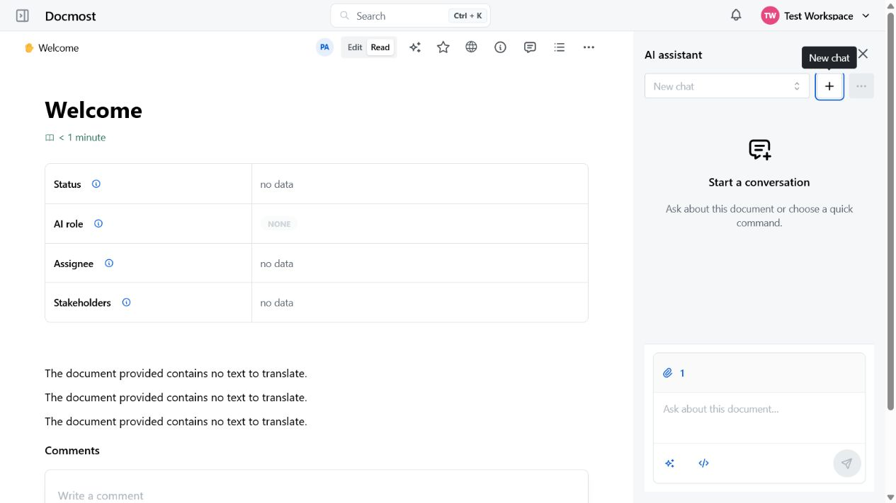

### 2. Context-aware AI workflows inside documents

The assistant can work not only with a user-entered message, but also with Docmost context:

- the current document;

- selected text;

- selected pages;

- databases and their rows;

- attachments from the current document;

- files uploaded directly to a private chat;

- space search results.

For selected text, actions include shortening, explaining, improving, correcting grammar, continuing, translating, and changing the tone.

AI output can be:

- used to replace the selected text;

- inserted below the selection;

- inserted at the current cursor position;

- regenerated;

- copied;

- reviewed together with the sources used.

The assistant also supports draft persistence, automatic chat titles, search across chats and commands, background AI activity indicators, and streamed generation.

The context manager uses one responsive dialog for overview, space search, child-page scope, and explicit descendant selection instead of stacking menus and nested dialogs.

The composer presents input and settings as one focus-aware card: context and search stay directly available, Chat/Agent mode uses a compact segment, and templates, Markdown tools, status, and send/stop actions remain in a stable footer. On narrow panels, secondary labels collapse without introducing horizontal scrolling.

Assistant profiles are deployment- and workspace-gated. Selecting a profile
does not send a message; an optional Start action can send a visible launch
message through the ordinary chat flow. Profile display name/version and
behavior snapshots remain stable in history, while live ACL and tool-policy
revocation still fail closed. Existing spaces and no-profile conversations keep
their previous behavior.

Agent mode is an optional per-conversation workflow. It can search and navigate
accessible Docmost content, then propose bounded edits to the current page.
Every write requires a separate initiator-only confirmation and is rejected if
the page content, write permission, or built-in tool policy changed before
approval. The shared built-in tool catalog is controlled by exact workspace and
space capability allowlists; optional context, database, table, comment,
history, transclusion, attachment-metadata, and public-share reads are off at
the deployment boundary by default and require explicit opt-in.

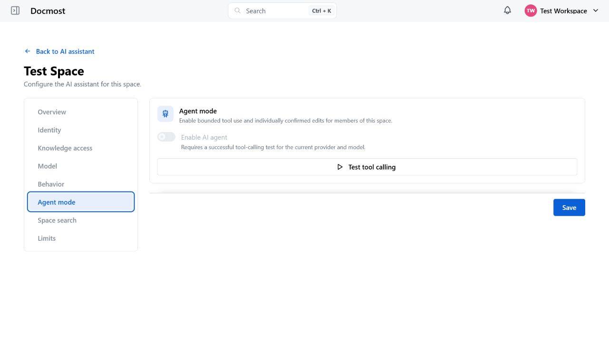

### 3. RAG and Open WebUI integration

The fork includes its own RAG API and integrations with external knowledge-retrieval systems.

Supported capabilities include:

- APIs for full and incremental synchronization of pages, databases, rows, attachments, and dictionary terms;

- API keys restricted to a specific space;

- a custom HTTP JSON retrieval adapter;

- direct integration with Open WebUI Knowledge Base;

- built-in per-space synchronization from Docmost to Open WebUI Knowledge Base;

- a unified `projectionVersion: 1` knowledge projection for enabled document and custom fields, named database properties and cells, database rows, and active `dictionary_term` sources;

- tracking of created, updated, and deleted content;

- attachment synchronization;

- Knowledge Base availability checks;

- filtering and revalidation of access permissions for retrieved sources;

- removal of embedded-sync files after AI content-policy changes, with page ACLs revalidated independently when retrieval results are used;

- SQL-backed cursor pagination and opaque deletion feeds;

- deduplication of contextual search results;

- separate RAG and MCP key types managed from one API keys page with dedicated tabs and onboarding presets;

- a shared content-exclusion policy applied to retrieval, synchronization, agent tools, and MCP results;

- a stateless read-only MCP endpoint for external assistants, using the same
  access-aware tool registry and exact capability policy as agent mode.

This allows Docmost content to serve as an up-to-date knowledge base for local
or corporate LLMs. RAG and MCP keys are scoped to one space, are not
interchangeable, and are revalidated on every request against the creator's
current membership and page access. Existing MCP keys retain only the seven
baseline reads; optional reads must be selected explicitly for each key.

For built-in synchronization, the Open WebUI URL, Knowledge Base ID, and a
separate writer API key are configured in each space's UI; the writer key is
stored encrypted in PostgreSQL. Deployment configuration supplies only
`RAG_SYNC_ENABLED=true`, the exact `RAG_SYNC_ALLOWED_ORIGINS` allowlist, and
shared operational limits. There is no separate container, worker, Compose
profile, or JSON configuration. The index includes every page and database row
allowed by the space AI content policy, plus active dictionary terms when the
space dictionary is enabled. Direct user access to the Open WebUI Knowledge
Base can therefore expose content beyond that user's Docmost ACL; query and
writer credentials must remain separate.

#### Outbound external MCP servers

The fork also supports the opposite direction: the internal agent can call
read-only tools on remote MCP servers. Docmost is the MCP client here, and this
surface shares no configuration or credentials with the inbound endpoint above.

Access requires every level to agree, and each one defaults to closed:

- a deployment kill switch (`AI_EXTERNAL_MCP_ENABLED`, off by default);
- a workspace master switch;
- the server being enabled, which is impossible until tools are approved;
- a space binding;
- no group denial;
- an explicit per-user opt-in, shown with a warning naming the destination.

A lower scope can only narrow a higher one. A workspace allowlist entry is
rejected unless the deployment allowlist already contains that origin, and a
space can only pick from what the workspace approved.

Everything a remote server says about itself is treated as hostile input. Remote
titles and descriptions are not stored at all, only the fact that they exist;
`readOnlyHint` and the other annotations are shown as claims and never decide the
read/write class; and JSON Schemas are rebuilt from an allowlist of structural
keywords, with `$ref` and `$defs` dropped, remote property names replaced by
opaque aliases, and prose-bearing keywords and string values removed. The
server-side mapping restores argument
names only at the RPC boundary. The only text about a tool that the model ever
sees is the description a workspace administrator typed. Results are
wrapped in an envelope marked untrusted, and the fixed Docmost safety policy is
stated before the external-tool rules, with space hints last and explicitly
non-overriding.

Other properties:

- read-only only, enforced both by the contract type and by a database check
  constraint, so an external tool can never propose a page change;
- per-server request headers encrypted with the application secret and never
  returned by any endpoint, only a boolean and, for workspace administrators, the
  header names;
- Streamable HTTP only, with a dual origin allowlist, DNS pinning, manual
  redirect handling, and a streaming response size cap;
- every agent run carries a versioned capability snapshot that is re-verified
  before each call, so revoking access or changing configuration stops a run in
  flight rather than widening it;
- an operational summary that records outcomes and latencies but no identifier,
  address, argument, or output.

Agent and MCP tool architecture adapted from [vvzvlad/gitmost](https://github.com/vvzvlad/gitmost) and [vvzvlad/docmost-mcp](https://github.com/vvzvlad/docmost-mcp). Special thanks to [@vvzvlad](https://github.com/vvzvlad) for developing and maintaining the fork, and to Moritz Krause, the original author of `docmost-mcp`.

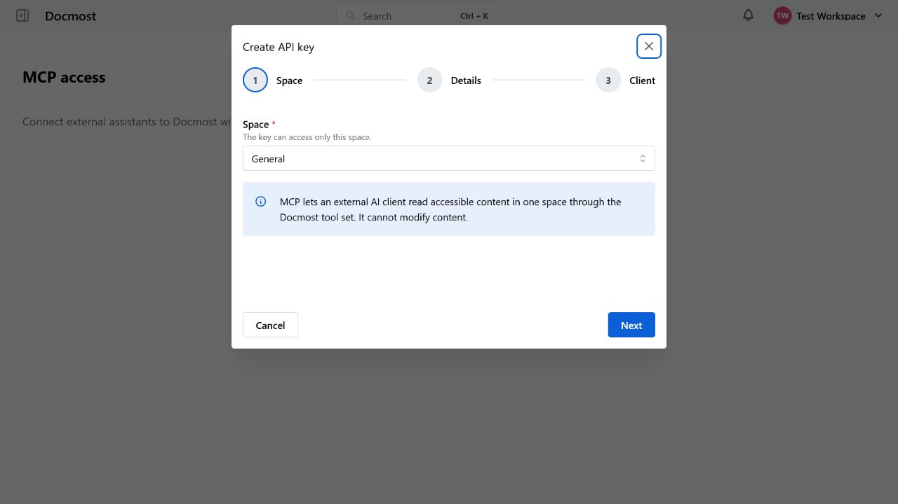

### 4. Reliable AI request infrastructure

AI features are implemented as a separate server-side subsystem:

- a dedicated processing queue;

- persistent storage of chats, messages, and runs;

- immutable generation attempts;

- idempotent message submission, retries, and file uploads;

- regeneration without corrupting chat history;

- task recovery when PostgreSQL and Redis become desynchronized;

- concurrent-run limits;

- up to six parallel provider requests per user;

- waiting agent approvals do not consume those provider slots and have a separate bounded queue;

- separate per-approval and whole-run budgets for agent model steps and tool calls;

- safe recovery of decided agent proposals after worker or queue interruption;

- token and quota controls;

- cancellation of an active response;

- protection against rerunning an already completed request;

- source snapshots preserved for each generation;

- hiding responses when access to the source material has been lost.

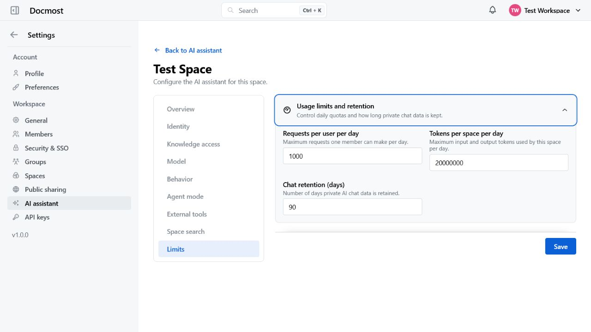

### 5. Notion-style databases

The fork includes structured databases:

- database rows are full pages;

- typed properties;

- filtering and sorting;

- column reordering;

- row and cell editing;

- actions for individual and selected rows;

- database properties displayed on the row page;

- tree-based navigation through rows and subpages;

- conversion of a regular page into a database and a database into a page;

- database change history;

- administrator-only deletion of individual history versions;

- correct copying and duplication of structures together with attachments.

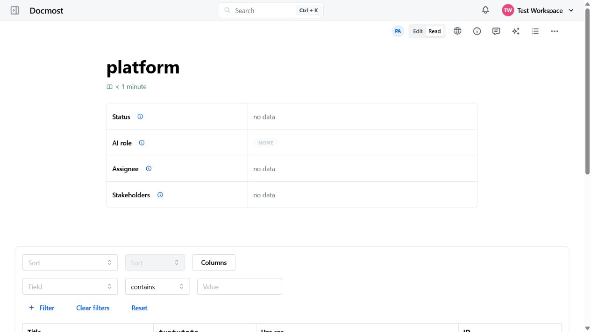

### 6. Extended document properties

Pages and database rows include configurable fields:

- status;

- assignee;

- stakeholders;

- AI role;

- estimated reading time.

The set of visible fields is configured separately for each space.

The AI role field indicates how AI participated in creating the document:

- `None`;

- `Editor`;

- `Coauthor`;

- `Coauthor+`;

- `Author`.

Changes to significant properties are recorded in the document history.

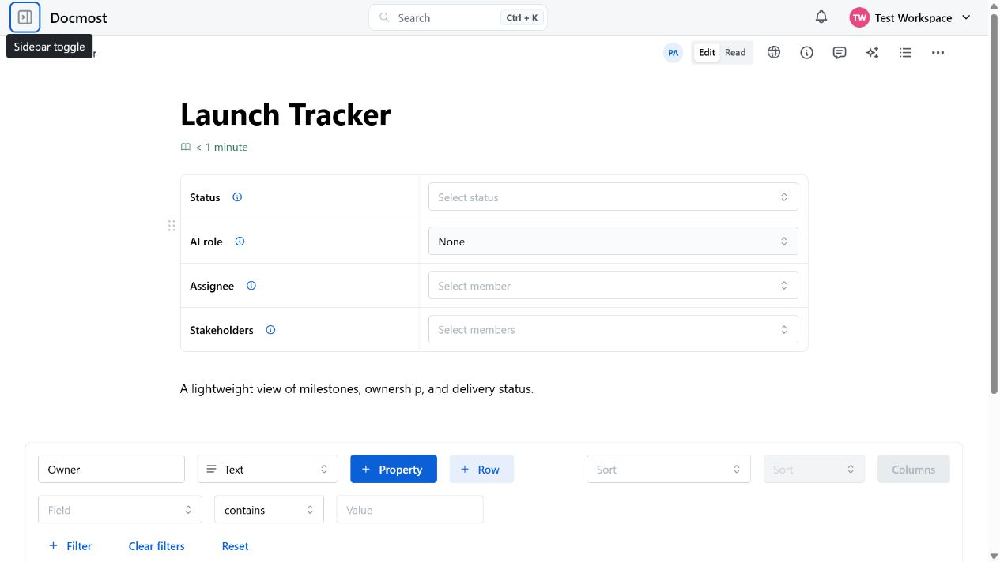

### 7. Tags and terminology dictionary

The fork provides more advanced terminology management:

- page labels scoped to a space, with descriptions shown on hover;

- six built-in inline tags: TBD, TODO, DONE, Core, Future, and Pilot;

- per-space controls for which built-in tags appear in the editor slash menu;

- portable tag availability settings in schema-V5 space archives;

- a terminology dictionary;

- word forms and term variants;

- LLM-assisted word forms for one term or every term in an enabled space;

- automatic highlighting of terms in documents;

- JSON dictionary import and export.

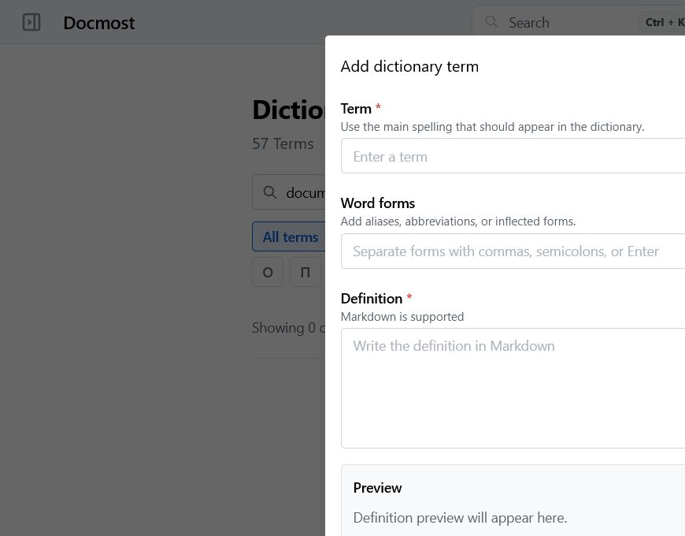

### 8. Search and content indexing

Search works across pages, databases, rows, attachments, and enabled dictionary terms while preserving current workspace, space, public-sharing, and page-level access rules:

- PostgreSQL full-text search is available by default;

- Typesense can be selected as a scalable candidate index;

- PDF and DOCX names and extracted text are searchable;

- Spotlight `All` mode separates document, attachment, and dictionary results, while database rows include matched-property context;

- dictionary terms, aliases, forms, and definitions and selected database property names and cell values are indexed;

- search filters cover spaces, content types, page labels, and multi-select inline TBD/TODO/DONE/Core/Future/Pilot tags;
- tag-aware document results group up to three anchored matching fragments and identify pages, databases, and database rows explicitly;

- result breadcrumbs show where a page or database row sits in the content tree;

- extraction has bounded byte, page, archive-entry, text-size, and wall-clock budgets;

- indexing status distinguishes pending, processing, ready, skipped, and failed files;

- abandoned work is reconciled after restart, while permanently unreadable files are not retried forever;

- indexed candidates are always reloaded from PostgreSQL and rechecked against live access policy before being returned.

See [Search architecture and operations](./docs/SEARCH.md) for Dictionary and
database-cell indexing rules, Typesense aliases, fallback, reindex, and
rollback procedures.

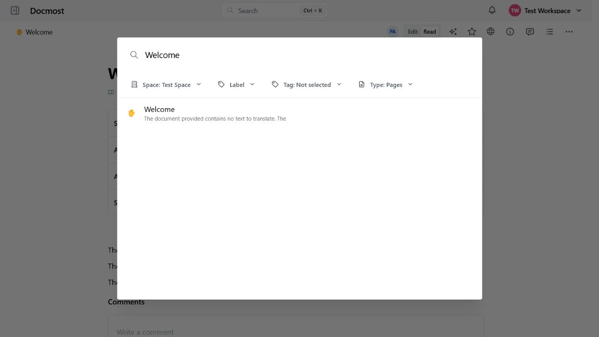

### 9. Extended editor

The editor includes the following additional capabilities:

- a fixed toolbar;

- indentation;

- page breaks;

- automatic heading numbering;

- personal numbering preferences;

- embedded PDF viewing;

- full-size image previews;

- width settings for individual blocks;

- improved table rendering;

- consistent default table widths and paste behavior;

- improved Draw.io, Excalidraw, and Mermaid diagrams;

- a subpage navigation block;

- rich link previews;

- page templates presented by outcome as independent copies or linked pages, with a searchable responsive catalog, preview/details panel, archive and restore;

- a two-step template creation flow and a single confirmation flow for choosing the template, page title, and same-space destination;

- published, immutable linked-template revisions with content-only background synchronization, localized progress and recovery states, version comparison, and safe detach or independent-copy actions;

- layered deployment, workspace, space, and group template policies with explicit effective results; workspace owners/admins and space admins ignore group overrides but still obey the higher-level feature switches;

- synced blocks created from selected document fragments, with reference lookup and safe unsyncing;

- a V5-only Docmost archive contract that rejects legacy whole-page `pageEmbed` data; creating new whole-page live embeds is not part of the editor or API contract;

- audio file upload and playback;

- alternative text for images and media.

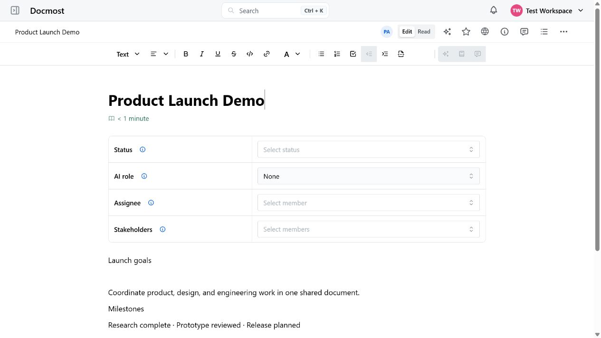

### 10. Import, export, and data portability

The export system for pages, spaces, and databases has been redesigned:

- Markdown;

- HTML;

- PDF;

- export of the current database view with its filters, sorting, and visible columns;

- export of child pages;

- export of attachments;

- more accurate PDF rendering of tables, diagrams, and system blocks.

Markdown, HTML, and PDF exports materialize accessible synced content and replace
denied or deleted sources with a neutral message. They do not expose internal
transclusion identifiers.

A custom portable Docmost archive format has also been added:

- export of pages, spaces, and databases;

- preservation of structure, properties, and attachments;

- optional restoration of portable document-field, heading-numbering, dictionary, and per-space built-in tag settings;

- import preview;

- import confirmation or cancellation;

- operation reports;

- protection against corrupted and excessively large ZIP archives.

Schema-V5 Docmost archives preserve and remap only synced relationships whose
source is inside the archive. External relationships are exported with an
access-checked snapshot and become ordinary content during import. Export emits
only V5; import preview, confirmation, and processing reject V2, V3, V4, newer
schemas, and any nested `pageEmbed` node.

Trusted legacy V2-V4 archive JSON can be converted outside the application with
`corepack pnpm --filter ./apps/server archive:convert-v5 -- --input=PATH --output=PATH`.
The converter uses only the supplied extracted archive or JSON file, preserves
modern synced-block snapshots, gives materialized legacy attachments separate
consumer ownership, and never connects to a Docmost runtime.

An existing database is evacuated separately before the destructive T040
migration. Run the candidate's read-only
`page-embed:prepare-removal` plan, then select explicit bounded policies under
full maintenance as documented in the
[legacy whole-page embed removal runbook](./apps/server/docs/page-embed-removal-runbook.md).

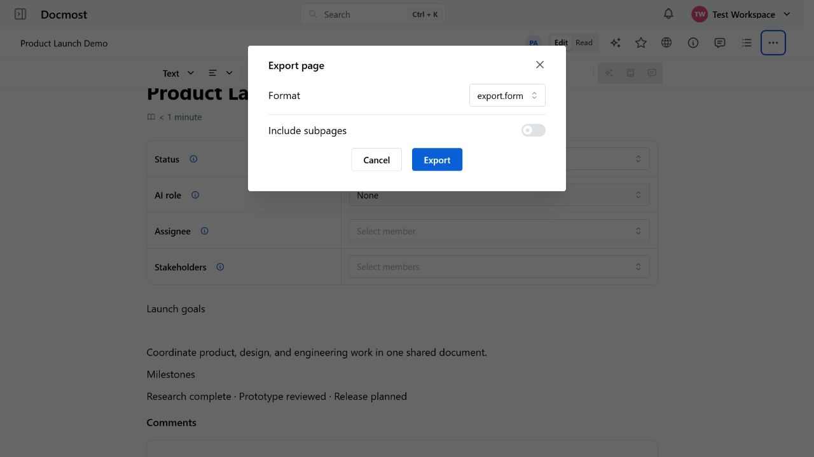

### 11. Comments and collaboration

The collaboration system has been extended with:

- page-level comments;

- inline comments;

- comment replies;

- resolving and reopening discussions;

- separate views for open and resolved comments;

- hiding resolved discussions;

- automatic collapsing of long comments and reply threads;

- copying a page to Markdown together with open and resolved comments and their document locations;

- indicators showing users who are viewing or editing a document;

- real-time user presence;

- more reliable page-tree synchronization.

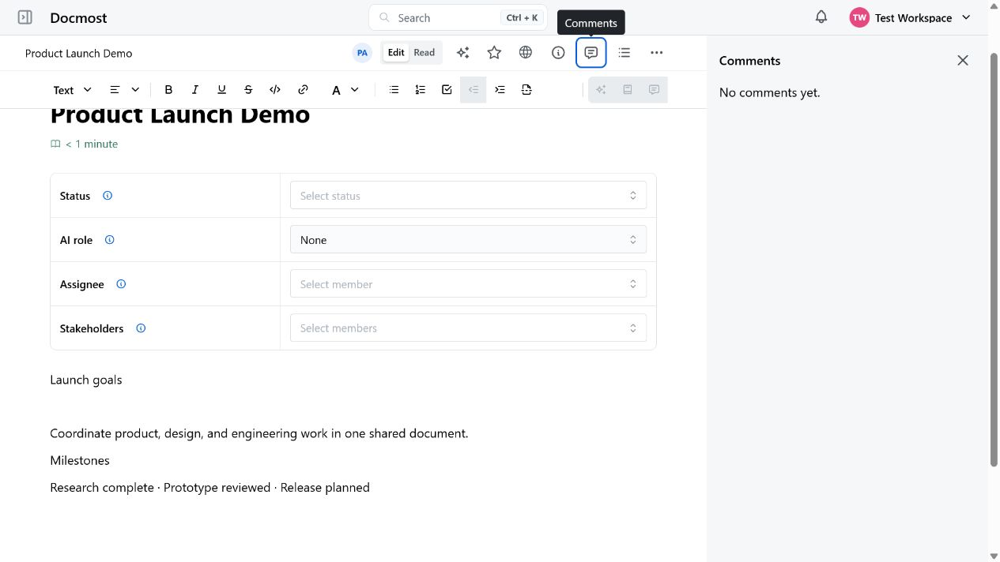

### 12. Notifications

An extended notification system has been added:

- in-app notifications;

- browser push notifications;

- mentions;

- comments and replies;

- assignee changes;

- stakeholder additions;

- significant document updates;

- immediate or aggregated delivery;

- configurable delivery intervals;

- the ability to disable email notifications;

- suppression of notifications already read by the user;

- recipient access checks for the document.

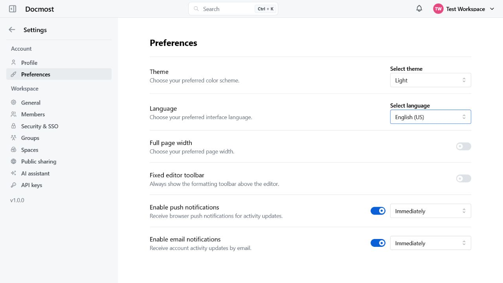

### 13. Access control

The fork provides stricter permission management:

- users can see only members with whom they share groups or spaces;

- the system `Everyone` group is hidden from regular members;

- access restrictions can be defined for individual pages;

- page permissions apply to database rows, search, export, and RAG;

- a restricted page is excluded together with its entire descendant tree;

- workspace settings are available only to administrators;

- space AI settings are available only to space or workspace administrators;

- an API key cannot grant more permissions than its creator has;

- API key access is revalidated on every request;

- public sharing can be disabled for the entire workspace or for an individual space;

- public pages, public search, and public attachments recheck the current sharing policy;

- OIDC, SAML, and LDAP group synchronization follows only mappings explicitly created by an administrator.

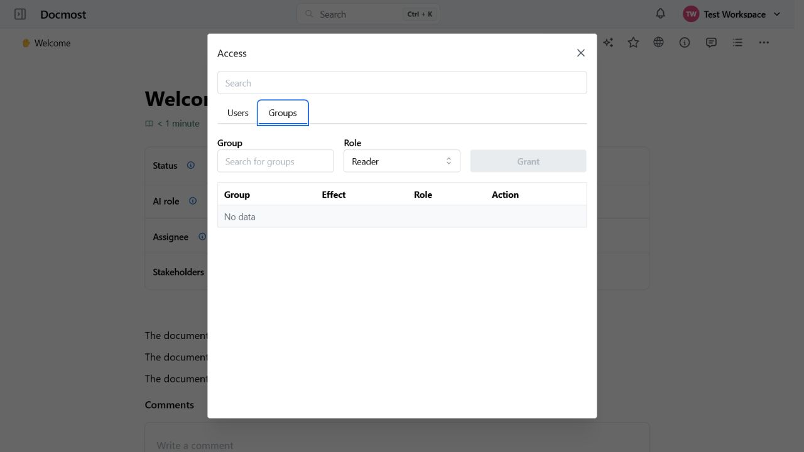

### 14. Security

Additional protection mechanisms include:

- TOTP-based two-factor authentication;

- backup codes;

- active user session management;

- revocation of one or all sessions;

- mandatory binding of JWTs to an active session;

- binding of collaboration tokens to the issuing session;

- CSRF protection;

- validation of allowed hosts and origins;

- rate limiting for authentication routes;

- hashing of password-reset tokens;

- secure Mermaid processing;

- allowlists for iframes and external resources;

- SSRF protection when connecting AI and RAG providers;

- DNS-pinned outbound AI/RAG connections after allowlist validation;

- Redis-backed per-key rate and concurrency limits for RAG and MCP;

- bounded PDF and DOCX parsing for private AI files;

- page-tree depth limits;

- protection against cyclic page moves;

- decompression limits and CRC validation for ZIP archives;

- resource filtering during PDF export;

- stricter validation of WebSocket rooms and messages;

- core OIDC Authorization Code flow with PKCE, state, and nonce;

- signed SAML responses bound to stored login requests;

- LDAP service and user binds with escaped filters and bounded searches;

- encrypted and redacted SSO credentials plus an explicit endpoint allowlist;

- provider verification before it is offered for sign-in, and a successful real login before SSO can be enforced;

- explicit administrator-managed SSO group mappings that never create arbitrary workspace groups.

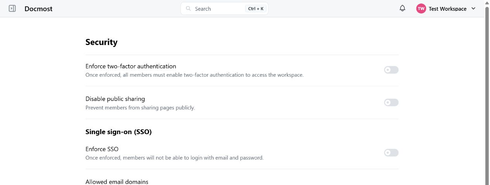

### 15. PWA, interface, and navigation

The fork can be installed as a Progressive Web App:

- a custom Service Worker;

- application shell caching;

- limited offline functionality;

- a dedicated offline page;

- automatic client-version updates.

It also adds:

- responsive tables and settings;

- improved mobile layouts;

- accessibility improvements;

- per-page Edit/Read mode and full-width preferences;

- optional restoration of the last scroll position;

- persistence of page-tree state;

- expansion of the entire tree;

- custom links with icons in the space sidebar;

- favorites for pages and spaces;

- space archiving and unarchiving, with archived content kept read-only;

- more consistent placement of controls.

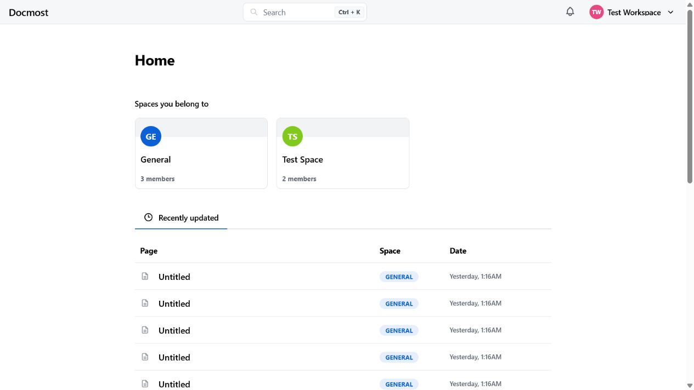

### 16. Operations and development

The fork includes its own maintenance and development infrastructure:

- one Docker build for the application and its built-in RAG Sync runtime;

- CI workflows;

- automated container publishing;

- environment variable validation;

- quick and full composite verification pipelines;

- a staging-only browser/API performance harness, always-on privacy-safe heap-pressure events, and opt-in route diagnostics documented in [`docs/PERFORMANCE_TESTING.md`](./docs/PERFORMANCE_TESTING.md);

- independent PID 1 supervisors for the API and collaboration processes, with immutable-image self-healing recovery gates;

- API route inventory generation;

- automated checks for RAG documentation drift and removed Enterprise Edition runtime remnants;

- security tests;

- architecture audits;

- circular dependency detection;

- duplicate and unused code detection;

- a blocking, expiring maintenance baseline that rejects new Knip or duplicate-code findings;

- a permanent contract that prevents external product telemetry from being reintroduced;

- OCI image version and source-revision labels for release provenance;

- architecture documentation;

- an `AGENTS.md` file for AI agents working with the repository;

- console-only recovery commands for rebuilding the search index and disabling broken SSO enforcement;

- coordinated, secret-free PostgreSQL and local-storage backup verification and restore tooling;

- Graphify support.

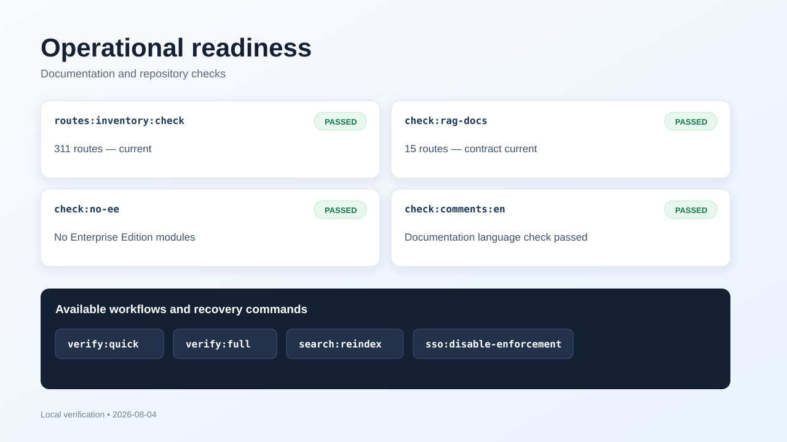

---

# Docmost

Open-source collaborative wiki and documentation software.

- [Website](https://docmost.com)
- [Documentation](https://docmost.com/docs)
- [Twitter](https://twitter.com/DocmostHQ)

## Getting started

The upstream [Docmost documentation](https://docmost.com/docs) remains the
product baseline. This fork's local files are authoritative for its added
AI/RAG/MCP behavior and deployment variables.

Host development:

```bash
cp .env.example .env
# Set APP_SECRET, COLLAB_INTERNAL_SECRET, DATABASE_URL, and REDIS_URL in .env.
corepack pnpm install --frozen-lockfile
corepack pnpm dev
```

Local/development Docker Compose:

```bash
cp .env.compose.example .env
# Replace both REPLACE_WITH_LONG_SECRET values and STRONG_DB_PASSWORD in .env.
docker compose up -d --build
```

Do not use the local Compose file as a production deployment definition. Follow
the [production deployment guide](./docs/DEPLOYMENT.md) for prerequisites,
immutable image selection, host configuration, external volumes and ingress,
clean installation, health verification, upgrades, and rollback. Production
uses the separate [`compose.production.yml`](./compose.production.yml), the
optional repository-owned [`compose.typesense.yml`](./compose.typesense.yml), the
[`env` template](./.env.production.example), immutable application and
PostgreSQL image digests, external database/file volumes, an external one-shot
schema migration, and fail-closed startup checks.

Follow the
[PostgreSQL production migration runbook](./apps/server/docs/postgresql-production-migration.md)
before any production database migration or PostgreSQL runtime change.

For coordinated application backups and restore rehearsals, including the
legacy archive boundary and separate-secret requirement, follow the
[backup and restore runbook](./docs/BACKUP_AND_RESTORE.md). The short commands
are `corepack pnpm backup -- create|verify|restore`; restore never reuses Redis
or a partially restored database volume.

Typesense is a rebuildable projection and is not part of the required archive.
Production deployments that enable it must include the checked-in hardened
overlay and rebuild it after restore using the [search runbook](./docs/SEARCH.md).

`pnpm dev` starts the frontend, API, and collaboration process separately.
`COLLAB_URL` is the browser-visible collaboration origin, while
`COLLAB_INTERNAL_URL` is the server-to-server origin. There is no supported
fallback that hosts `/collab` on the API process.

The local Compose topology fixes `COLLAB_INTERNAL_URL` to
`http://collab:3001` and starts the API only after the collaboration health
check passes. A host-development `.env` may therefore keep
`COLLAB_INTERNAL_URL=http://localhost:3001` without redirecting traffic inside
the API container. Custom container topologies should override the service
environment in a non-versioned `docker-compose.override.yml`.

Compose starts independently supervised API and dedicated collaboration child
processes from the same application image. Readiness remains `/api/health`,
while the supervisors use `/api/health/live`. `APP_SECRET` and the independent `COLLAB_INTERNAL_SECRET`
from `.env` are mounted as Docker
secrets and are not copied into container configuration metadata. Optional
credential secrets are defined but not granted by the base stack, so disabled
S3, SMTP, Postmark, Typesense, and Web Push integrations do not require dummy
values.

When an optional integration is enabled, grant only its secret to both
application services from a non-versioned `docker-compose.override.yml`. For
example, Typesense uses the existing `TYPESENSE_API_KEY` value from `.env`:

```yaml
services:
  docmost:
    environment:
      TYPESENSE_API_KEY_FILE: /run/secrets/docmost_typesense_api_key
    secrets:
      - docmost_typesense_api_key
  collab:
    environment:
      TYPESENSE_API_KEY_FILE: /run/secrets/docmost_typesense_api_key
    secrets:
      - docmost_typesense_api_key
```

The required application secret names are `docmost_app_secret` and
`docmost_collab_internal_secret`. The available optional secret names are
`docmost_aws_s3_secret_access_key`, `docmost_smtp_password`,
`docmost_postmark_token`, `docmost_typesense_api_key`, and
`docmost_web_push_vapid_private_key`. Granting a secret with an unset source is
a Compose error, and an empty or unreadable mounted secret is a startup error.

For the Ubuntu layout where `/opt/edge-proxy` already owns the external
`edge` network, set `EDGE_NETWORK_NAME=edge` and
`EDGE_NETWORK_EXTERNAL=true` in `/opt/docmost/.env`. The proxy and Drawio
Compose files do not need changes. Local Compose keeps the defaults and creates
its own `docmost_edge` network.

Open WebUI synchronization runs inside the main Docmost process. Enable the
deployment boundary and approve the exact Open WebUI origin in the same root
`.env` used by Docmost:

```dotenv
RAG_SYNC_ENABLED=true
RAG_SYNC_ALLOWED_ORIGINS=https://open-webui.example.com
```

Then configure the pre-created Knowledge Base and its writer API key in each
space's AI settings. Writer credentials are encrypted in PostgreSQL and are not
placed in Compose or Docker metadata. Query-time retrieval remains a separate
per-space setting with its own credential. One Knowledge Base can be claimed by
only one space. A normal disable drains Docmost-managed files and keeps the
configured target reserved for that space; force disable is available when the
remote service is unavailable.

The ordinary `docker compose up -d --build` command starts the complete local
stack. The collaboration process uses the same image and compiled server
artifact. There is no `rag-sync` profile, service, or second image. Redis is
shared with the backend through a versioned `RAG_SYNC_REDIS_PREFIX` namespace.

See [`ARCHITECTURE.md`](./ARCHITECTURE.md) for system boundaries,
[`docs/AI_ASSISTANT_AND_RAG.md`](./docs/AI_ASSISTANT_AND_RAG.md) for the
canonical AI/RAG/MCP architecture and recovery guide,
[`docs/AI_INTEGRATION.md`](./docs/AI_INTEGRATION.md) for operator setup, and
[`docs/RAG_API.md`](./docs/RAG_API.md) for the external synchronization API.

## Features

- Real-time collaboration
- Diagrams (Draw.io, Excalidraw and Mermaid)
- Spaces
- Permissions management
- Groups
- Comments
- Page history
- Search
- File attachments
- Embeds (Airtable, Loom, Miro and more)
- Translations (10+ languages)

### Screenshots

<p>


</p>

### License

This repository is licensed under the open-source AGPL 3.0 license.

### Contributing

See the [development documentation](https://docmost.com/docs/self-hosting/development)

## Test toolchain version matrix

Validated backend coverage stack (Node 22) used in this repository:

| Component        | Version | Notes                                                             |
| ---------------- | ------- | ----------------------------------------------------------------- |
| Node.js          | 22.x    | Runtime baseline for local/dev and container builds.              |
| Jest             | 30.2.0  | Main test runner for backend unit/integration tests.              |
| ts-jest          | 29.4.6  | Single TypeScript transformer for backend Jest config.            |
| babel-jest       | 30.2.0  | Version pinned at workspace level to avoid accidental mismatches. |
| test-exclude     | 6.0.0   | Coverage include/exclude helper used in Jest/Istanbul ecosystem.  |
| coverageProvider | v8      | Native Node V8 coverage provider (no Babel Istanbul transform).   |

Backend smoke command for early coverage regressions:

```bash
pnpm --filter ./apps/server test:cov:smoke
```

## Local quality-check checklist

Run these commands before opening a PR:

```bash
pnpm install --frozen-lockfile
pnpm verify:quick
```

Before release candidates or broad architecture changes, run:

```bash
pnpm verify:full
```

For a release candidate, run the complete release contract against the
documented production-like PostgreSQL, Redis, API, and collaboration runtime:

```bash
pnpm check:release-version
pnpm check:fork-docs
pnpm verify:release
```

The version gate requires matching root, client, and server package versions,
runtime-derived MCP versions, and an exact `v${package.version}` release tag.
The fork-documentation gate requires the administrator AI guide contract and
the English/Russian fork descriptions to retain the same numbered capability
structure, paired images, stable AI-guide anchors, and critical semantic
coverage. `verify:release` also opens the administrator guide in both languages
through the production-like AI browser acceptance suite.
For the current candidate the only accepted release tag is `v1.2.7`. Follow the
[v1.2.7 upgrade and rollback notes](./apps/server/docs/release-notes/v1.2.7.md)
before deployment.

For backend changes:

```bash
pnpm --filter ./apps/server lint
pnpm --filter ./apps/server test
pnpm --filter ./apps/server test:alias:smoke
```

For frontend changes:

```bash
pnpm --filter ./apps/client lint
pnpm --filter ./apps/client test
```

For comment-language validation (required):

```bash
pnpm check:comments:en
```

Runtime/tooling baseline used in this repository:

- Node.js 22.x
- pnpm 10.4.0

## Thanks

Special thanks to;


[Crowdin](https://crowdin.com/) for providing access to their localization platform.


[Algolia](https://www.algolia.com/) for providing full-text search to the docs.
