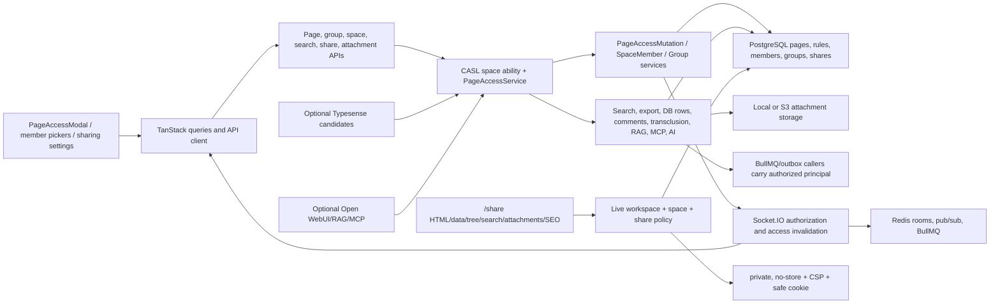

# G20 page ACL, member visibility, and public sharing audit - 2026-08-10

## 1. Verdict

**PASS WITH RISKS after fixes.** Three reproducible G20 defects in the current
`main` snapshot were fixed in production code, committed separately, rebuilt
into the production image, and retested. The final retained ACL isolation run
passed `179/179` assertions with `fatalError: null` and completed fixture
cleanup. No unresolved G20 defect is known to expose a forbidden page,
attachment, comment, database row, transclusion source, export descendant,
RAG/MCP result, or public-share resource.

The G20 fixes themselves do not block release. An unqualified release-wide
PASS is not possible on this snapshot for the following reasons:

- the full client suite has two pre-existing failures outside G20: `de-DE`
  lacks `Inactive`, and the AI administrator-guide key-count test expects 30
  keys but finds 31. The serial `verify:full`/`verify:release` wrapper would
  therefore stop before completing;
- the live stack uses `SEARCH_DRIVER=database`. PostgreSQL authorization and
  stale client hydration were tested, but a live Typesense instance was not
  configured in this contour. Typesense candidate-only authorization was
  reviewed statically and is owned by G11;
- local storage and same-origin HTTP public sharing were tested. No CDN,
  reverse proxy, S3, Postmark, or external SEO crawler was configured;
- browser acceptance used local Chromium/Playwright. WebKit, Firefox, mobile
  devices, and a screen reader were not available;
- the historical OWASP ZAP passive report in commit `7f3144a8` was read, but no
  new ZAP image was introduced. Current CSP, cookies, and cache headers were
  independently probed over HTTP instead.

## 2. Fixed scope and history

### Repository coordinates

| Coordinate | Value |
| --- | --- |
| Release baseline | `v1.0.0` / `446f6ddd68d87b28d6d1e2add90c235495149970` |
| Fixed audit head | `e955a0c8d13be6384a08988f40b4331b9b686ce8` |
| Starting current-main HEAD | `cb1befb186c4263cd22f52fff4577fb73c5c671f` |
| Starting describe | `v1.0.0-170-gcb1befb1` |
| Audit branch | `codex/g20-page-acl-public-sharing` |
| Audit worktree | `D:\DevProjects\docmost-qa-G20` |
| Final tested branch HEAD | `915f08adca6a46b1b2164ecbf79a0603215fe68d` |
| Final tested describe | `v1.0.0-173-g915f08ad` |
| Final tested image | `docmost-local:dev`, image ID `sha256:81597657d859319033af52e878f3418844458383492f83f05288592d5eae39f4` |
| Local-main integration | Performed after this report commit; exact final `main` HEAD is recorded in the task handoff. |

The original checkout had only user-owned changes under `graphify-out/*`.
They were not staged, reverted, overwritten, or merged. Graphify generated the
same class of worktree-local changes in the G20 worktree; they are excluded
from every G20 commit and remain local to the audit worktree. The original
`main` changes are untouched.

### Relevant history read

The primary range `v1.0.0^..e955a0c8` was inspected with `git show --stat
--summary` and full diffs, not commit subjects alone. The directly relevant
commits were:

| Commit | Audit use |
| --- | --- |
| `0b1a6239` | Tenant-scoped public shares, no-store responses, SEO policy revalidation, and public route boundaries. |
| `7f3144a8` | Original 162-assertion ACL isolation harness, role screenshots, SQL policy matrix, and historical ZAP evidence. Assertions and fixtures were read before reuse. |
| `91c391a`, `532ab4b8`, `1dda576`, `93e3d966` | Public-sharing policy, page-access integration, member visibility, and adjacent route enforcement. |
| `dacc68ff`, `dc51e0f2`, `e3a63401`, `be4ed49` | Search, exports, comments, attachments, databases, and transclusion propagation. |
| `3d04ede`, `f478550`, `2000e62`, `6e355ecb`, `7c9b351c`, `df0cfc82` | API key, RAG/MCP/AI, websocket, session, and access-mutation behavior. |

Earlier path history from
`0aeaa43112f5b9d808a9bf9b437db8247b39ff03..v1.0.0` was read for the
baseline model. The following path-touching changes in
`e955a0c8..cb1befb1` were reviewed before editing and preserved:

- `77bfe89f` group policy fail-closed behavior for AI/MCP;
- `bd9061ce` ACL-sensitive client search invalidation;
- `ca49d464` public-share search input hardening;
- `51f691af` and adjacent search/public route updates;
- `aa5b92e5` and other path-touching authorization regressions already fixed by
  prior contours.

### Files, contracts, migrations, and documentation inspected

- server authorization: `apps/server/src/core/page-access/*`,
  `apps/server/src/core/page/services/page-access-mutation.service.ts`, page
  controller and repositories, CASL `space-ability.factory.ts`, workspace,
  space-member, group, group-user, user visibility, session, and API-key
  services;
- server surfaces: search database/Typesense services, export services,
  database row hydration, RAG/MCP/AI prompt and tool lookup, comments,
  transclusion lookup, attachments, WebSocket/collaboration authorization, and
  queue/outbox callers that carry an authorized user;
- public sharing: share controller/service/DTOs, public search, public
  attachment token/cookie validation, SEO controller, static routing,
  `robots.txt`, security middleware, and CSP construction;
- client: `page-access-modal.tsx`, page tree/header menus, page service/types,
  member and group selectors, workspace/space sharing settings, public share
  pages, TanStack search queries, websocket query subscription, and active
  document reload behavior;
- contracts and schema: `packages/api-contract/src/page.ts`, generated route
  inventory, `20260329T120000-page-access-rules`,
  `20260730T200000-share-page-uniqueness`,
  `20260805T120000-watcher-access-cleanup`, generated database types, unique
  active-share index, and all 101 current migrations through
  `20260810T090000-repair-sso-credential-encryption`;
- docs/tests: `ARCHITECTURE.md`, `README.md`, API routing conventions,
  security regression runbook, AI/RAG docs, the relevant server/client unit
  suites, historical ACL artifacts, and G11 search authorization notes.

## 3. Implementation map

### Central authorization model

- Workspace `owner|admin` receives system-level bypass. Ordinary principals
  resolve a space role and then direct page-user and page-group rules.
- Direct user rules take precedence. Any matching group deny wins among group
  rules; otherwise the strongest group allow applies; otherwise the space role
  applies. Explicit deny yields no read/write/create-child capability.
- Page mutations write the complete descendant subtree. Newly created children
  copy the effective parent rules. A page ACL `writer` can update/create but
  cannot move, delete, share, or manage ACL unless their space/system role also
  permits it.
- `PageAccessService` supplies both single-page decisions and batch readable /
  writable snapshots. Database rows, search hydration, export pruning, RAG,
  AI/MCP tools, comments, attachments, synced blocks, and watcher delivery use
  those decisions rather than treating candidate IDs as authorization.
- Ordinary member suggestions and directories are limited to users sharing a
  group or space. The default `Everyone` group and foreign/unrelated groups are
  omitted, including object-ID probes.

### Public-sharing boundary

- Workspace `settings.sharing.disabled`, space
  `policy.effective.disablePublicSharing`, the active share row, page liveness,
  workspace/space ownership, and `includeSubPages` are revalidated on every
  public request.
- The `20260730T200000-share-page-uniqueness` migration removes duplicate
  active page shares deterministically and creates a database unique index.
  Concurrent creates converge on one active share ID.
- Public page data, tree, search, attachments, synced blocks, and SEO HTML are
  scoped to the same share/workspace. Denied or unrelated descendants and
  transclusion sources are not projected.
- Public responses use `Cache-Control: private, no-store`, `Pragma: no-cache`,
  and `Expires: 0`. CSP contains `form-action 'self'`. The attachment access
  cookie is `HttpOnly`, `SameSite=Lax`, scoped to `/api`, and intentionally not
  `Secure` on the audited plain-HTTP localhost origin.

### Switches, limits, cache, jobs, logs, and recovery

- Relevant switches: workspace sharing setting, space policy override,
  `SEARCH_DRIVER` (effective default `database`), `STORAGE_DRIVER` (effective
  default `local`), `RAG_SYNC_ENABLED=true`, deployment AI/MCP origin
  allowlists, and `TRUSTED_PROXIES` (empty).
- Page hierarchy queries are bounded by `MAX_PAGE_TREE_DEPTH`; public trees and
  exports prune denied subtrees. Search queries are DTO-bounded and hydrate
  live PostgreSQL rows after candidate retrieval.
- There is no server response cache for public shares. Client search/query
  caches are ACL-sensitive. Production mutations now target affected user
  rooms with both `access:invalidate` and `AUTHORIZATION_CHANGED`; the active
  document is reloaded so rendered private content disappears without waiting
  for a navigation or restart.
- Space membership add/update/remove, group membership changes, page-user and
  page-group rule changes, and access-bearing group deletion all publish the
  affected authorization change. Group deletion computes affected users and
  pages before the transaction removes the rows.
- Redis is transport/cache/queue infrastructure, not the authorization source.
  A Redis restart recovered without changing PostgreSQL decisions, and the
  post-restart ACL harness remained green.
- Relevant asynchronous paths are export/import, attachment processing,
  watchers/notifications, RAG sync, and queue outbox. Authorization is checked
  at read/delivery time or an authorized principal is carried into subtree
  filtering. No ACL mutation is delegated to a background job.
- Privacy-safe events inspected include authorization rejection, websocket
  relay rejection, public attachment failure, and queue/outbox terminal codes.
  Synthetic canary scans found no retained content in DB, Redis, storage,
  logs, or outbox payloads.

## 4. Environment and external tools

| Tool | Provenance and exact version | Isolation and data |
| --- | --- | --- |
| Docmost | Local production Dockerfile, branch image at `915f08ad`; image ID `sha256:81597657...` | Main local Compose project; app bound to `127.0.0.1:3000`. Only synthetic audit workspaces/pages and the supplied test session were used. |
| PostgreSQL | Official `postgres:18-alpine@sha256:9a8afca54e7861fd90fab5fdf4c42477a6b1cb7d293595148e674e0a3181de15` | Main DB stayed inside Compose. Final backend E2E used an additional `--rm` container on `127.0.0.1:55432` with synthetic credentials, then removed it. |
| Redis | Official `redis:8-alpine@sha256:978f0e01593e65eed801f2402944efcd936d43b5027e4908a7897baf88ed6241`; server 8.10.0 | Main Redis stayed inside Compose. Final E2E used an additional `--rm` container on `127.0.0.1:56379`, then removed it. |
| Browser | Repository Playwright 1.62.1, bundled Chromium, plus Codex in-app Chromium inspection | Local browser contexts only; owner/member contexts were isolated and concurrent where the scenario required it. No source, cookies, or traces were sent to SaaS. |
| AI context mock | Repository `deterministic-model.mjs` on host port 1080 | Synthetic prompts/files only. Runtime provider/retrieval allowlists were temporarily narrowed to the local mock and then restored; `local_mock_origin_absent=True` was verified. |
| Python fixtures | Codex bundled Python at `C:\Users\Pavel\.cache\codex-runtimes\...\python.exe` with the repository fixture requirements | Local PDF/DOCX generation/sanitization only. The system Python lacked `pdfplumber`; no package was installed globally. |
| Host | Docker Desktop 29.5.3, Node 24.16.0, Corepack pnpm 10.4.0, Windows 11 | All published test ports were bound to loopback. |

No new external MCP server, SaaS scanner, active ZAP scan, CDN, or remote data
processor was used. The exact official PostgreSQL/Redis images already pinned
by the repository covered migration, retry, restart, and partial-failure paths
without widening the data boundary.

## 5. Coverage matrix

| Requirement/scenario | Static/unit | Integration/fault/security | Browser | Result and evidence |
| --- | --- | --- | --- | --- |
| Owner/admin/member and space admin/writer/reader | CASL and page-access suites | Read/update/move/delete/search/attachment/database/comment matrix | Isolated role contexts and direct URLs | PASS; final baseline has all expected 200/403/404 results. |
| Direct user/group allow/deny, Everyone | Precedence and mutation tests | Writer allow, explicit user/group deny, hidden Everyone/object-ID oracle | Modal grant/close plus denied viewer | PASS; `ui-page-access-modal-6e785031.png`. |
| Nested pages and inherited denied subtree | Descendant mutation and batch ACL tests | Parent deny blocks existing/new descendants; export prunes denied grandchild | Open page removed live | PASS. |
| Principal search/visibility | search-query and member visibility review | Owner suggestion 200; non-admin mutation 403; unrelated users/groups hidden | Typing emits suggestion request and resolves fixture principal | PASS after G20-003; `ui-acl-picker-6e785031.png`. |
| ACL UI add/update/close and optimistic state | Modal/service review and propagation unit tests | Grant writer/allow, close to explicit deny, re-fetch rows | Modal remains open during typing; rows refresh; viewer gets 403 | PASS. Concurrent stale-update response shape was covered by upsert semantics; no versioned optimistic contract exists. |
| Rows/search/export/RAG/MCP/AI/comments/attachments/transclusion | Shared access call graph and suites | Database hydration, search revoke, export prune, RAG creator downgrade, MCP reads, comment/attachment status, public synced-block scope | Direct URL and live result removal | PASS. |
| Live page-rule/space-member/group changes | New service/gateway/query tests | PostgreSQL decision changes without restart; Redis restart and reconnect | Two contexts; rendered page disappears after each change | PASS after G20-001/G20-002. |
| Public workspace/space/page gates | Share/controller/policy suites | Create, disable/re-enable, revoke, deleted page, foreign ID | Anonymous share/data/HTML probes | PASS. |
| Duplicate active share and concurrency | Transaction/index review | Five concurrent creates, one active share ID | N/A | PASS. |
| Public HTML/data/tree/search/attachments/transclusion | Public projection tests | Hidden descendants/sources absent; attachment token invalidated | Anonymous same-origin reads and screenshots | PASS. |
| Cache/CSP/cookies/SEO after revoke | Header and SEO suites | Immediate 404/empty search/attachment denial | Network header inspection before/after policy changes | PASS; private/no-store, form-action, safe cookie verified. |
| API key creator and AI source after ACL change | RAG/MCP/AI authorization suites | Creator downgrade makes denied page 403 while readable page stays 200 | AI context E2E final pass | PASS. |
| Timing/error-shape/existence oracle | Controller/service review | Foreign vs nonexistent share both 404; median delta 0.22 ms; cross-tenant page/share/database oracle | Direct URL equivalent state | PASS for local sample; not a statistical side-channel proof. |
| Retry/restart/partial failure | Redis transport and E2E suites | Main Redis restart; isolated migrations; queue/collab lease tests; app recreate | Reload/reconnect after revoke | PASS. |
| Canary retention | Redaction utilities and log review | `db=0 redis=0 storage=0 logs=0 outbox=0` for final run ID | Artifact scanners exact-match auth/csrf | PASS; both secret scans clean. |

## 6. Command and check log

Read-only `rg`, `git log`, `git show`, `git diff`, `git status`, Docker inspect,
SQL select, and browser DOM/network inspection commands exited 0 unless noted.
The material commands and all observed failures are listed below.

| Command/check | Exit | Result |
| --- | ---: | --- |
| `git status --short; git rev-parse HEAD; git describe --tags --always` on initial `main` | 0 | Only pre-existing `graphify-out/*` changes; HEAD `cb1befb1`. |
| `git worktree add -b codex/g20-page-acl-public-sharing ../docmost-qa-G20 main` | 0 | Isolated audit branch created. |
| `corepack pnpm install --frozen-lockfile` | 0 | Lockfile unchanged. |
| `git show --stat --summary` and full `git show` for `0b1a6239`, `7f3144a8`, related commits and path logs | 0 | History and prior evidence read. |
| Historical harness before production fixes | 0 process / 2 assertion failures | `163/165`; open direct revoke and space removal retained rendered content. |
| Harness after `35cdcde6` | 0 | `165/165`. |
| Group-deletion extension before `da18dfca` | 0 process / 1 assertion failure | `166/167`; open page remained visible after access-bearing group deletion. |
| Extended pre/post Redis restart harness | 0 | `174/174`; retained `baseline-485e372b.json` and `baseline-18eceb22.json`. |
| ACL modal diagnostics before `915f08ad` | 0 process, invalid audit result | `baseline-dcd09aa1.json`: first `A` caused `dialogCount=0`, `inputCount=0`, request count 0. Several earlier diagnostic runs ended with `fatalError`; none is used as green evidence. |
| `corepack pnpm exec vitest run src/features/page/utils/page-access-ui.test.ts` | 0 | 1 file, 5 tests passed after G20-003. |
| Package-local ESLint for all touched server/client files | 0 | No findings. An earlier root-level `eslint` invocation failed because the root has no `eslint.config`; corrected package-local commands passed. |
| `corepack pnpm --filter ./apps/client build` | 0 | TypeScript and Vite production build passed; only existing chunk-size warning. |
| `docker compose ... build docmost` after each fix | 0 | Final image ID `sha256:81597657...` from `915f08ad`. |
| `docker compose ... up -d docmost` after each fix | 0 | Final container healthy; `/api/health` 200. |
| Final ACL/browser harness | 0 | `179/179`, `fatalError: null`, cleanup completed; `baseline-6e785031.json`. |
| `corepack pnpm --filter ./apps/server test -- --runInBand page-access share space-ability` | 0 | Final: 8 suites, 56 tests passed. |
| Additional changed-service specs for group-user/group/space-member/ws/page mutation | 0 | 12 suites, 79 tests passed in the post-server-fix run. |
| Final targeted client command | 0 | 3 files, 12 tests passed. |
| `corepack pnpm run test:security` | 0 | Final: server 66 suites/786 tests; client 6 files/74 tests. |
| First `corepack pnpm --filter ./apps/server test:e2e` against main Compose | 1 | Baseline environment mismatch: host Node could not route Compose-only PostgreSQL/Redis; Redis `ETIMEDOUT` and DB hook timeout. No product assertion ran. |
| Isolated `migration:latest` | 0 | 101/101 migrations applied through `20260810T090000-repair-sso-credential-encryption`. |
| Final isolated `corepack pnpm --filter ./apps/server test:e2e` | 0 | 4 suites, 17 tests passed; temporary containers removed. |
| First `corepack pnpm run test:ai-context:e2e` | 1 | Host system Python lacked `pdfplumber`; test stopped before API/browser assertions. |
| Final AI-context E2E with bundled Python | 0 | `AI context audit passed: 019fec39-60f6-7c5e-aafc-484e94e7b97d`. |
| `check:env`, route inventory, RAG docs, comments, exception journal, text contracts, no-EE, architecture, release gates, AI docs | 0 | All available contract subchecks passed; route inventory contained 312 routes. |
| Full `corepack pnpm --filter ./apps/client test` baseline | 1 | 125 files; 612/614 tests passed. Failures: missing `de-DE` `Inactive`; AI guide count expected 30, found 31. Not changed by G20. |
| `corepack pnpm verify:release` | Not run | Serial wrapper would deterministically stop at the known full-client failures. All relevant available substeps were run separately. |
| Initial migration count query against nonexistent table `migrations` | 1 | Audit command error only; corrected to `kysely_migration`, which returned 101/latest. |
| Public share HTTP probes | 0 | Info/data/SEO 200 before revoke; no-store/CSP/cookie attributes present; immediate 404/empty after disable. |
| `sanitize-traces.mjs` and `scan-artifacts.mjs` for ACL and AI evidence | 0 | Both exact-secret scans clean; no findings. |
| Final count-only canary scan | 0 | PostgreSQL 0, live Redis payloads 0, storage 0, app logs 0, queue_outbox 0. |
| First `graphify update .` / `graphify save-result` in the sandbox | 1 each | Local filesystem policy denied temporary cache/memory writes; no source mutation failed. |
| Escalated local `graphify update .` and `graphify save-result` | 0 | 14,041 nodes/41,149 edges rebuilt; useful G20 propagation query saved locally. |

## 7. Findings

| ID | Severity | Component | Reproducibility | Expected / actual | Root cause | Status / fix |
| --- | --- | --- | --- | --- | --- | --- |
| G20-ACL-001 | High | Page/space ACL live invalidation | 2/2 before fix | A revoked open page must disappear immediately / rendered confidential content remained until navigation or reload | `access:invalidate` only invalidated search-like client queries; space member mutations emitted no targeted authorization event; the active page document was not reloaded | Fixed in `35cdcde610bd46522639db469412009d98906885` |
| G20-ACL-002 | High | Group deletion propagation | 1/1 before fix | Deleting an access-bearing group must revoke open sessions / the group member kept the rendered page | Group deletion cascaded DB rows without collecting affected users/pages or emitting `access:invalidate` and `AUTHORIZATION_CHANGED` | Fixed in `da18dfca4d829fdf2b2e4e9f2d92e38e3712fbac` |
| G20-UI-003 | Medium | Page access modal | 3/3 before fix | Typing in the principal picker must keep the modal open and request suggestions / the first `keydown` bubbled into the page tree, which remounted `NodeMenu`; no request was sent | Modal stopped pointer propagation only; keyboard events from the portal reached parent tree handlers | Fixed in `915f08adca6a46b1b2164ecbf79a0603215fe68d` |

### G20-ACL-001 reproduction and impact

1. Open the same synthetic page as owner and reader in separate Chromium
   contexts.
2. With the reader page visibly rendered, either create a direct deny or
   remove the reader from the space.
3. Observe successful mutation and 403 on a new page-info request.
4. Before the fix, the existing reader tab retained the title/content. The
   harness failed `open tab loses page live after direct page rule revoke` and
   `open tab loses page after membership removal`.

Impact: revoked users could continue reading already-rendered confidential
content for the lifetime of the open SPA state. PostgreSQL and new API requests
were correct; the leak was the live client state and websocket propagation.
The fix targets only affected user rooms, invalidates ACL-sensitive queries,
emits an authorization refresh, and reloads the active document. Final direct
deny and membership removal checks both removed the content without restart.

### G20-ACL-002 reproduction and impact

1. Grant a group inherited read access to a nested page and open it as a group
   member.
2. Delete the group as workspace owner while the member tab remains open.
3. Confirm the new API request is forbidden.
4. Before the fix, the rendered page remained visible. After the fix it is
   removed live and remains absent after reload.

Impact is equivalent to G20-ACL-001 for group-derived access. The service now
captures access-bearing page IDs and affected user IDs before deletion, then
emits targeted access and authorization events after the transaction. Empty or
unrelated groups do not cause broad workspace invalidation.

### G20-UI-003 reproduction and impact

1. As owner, open the page-tree `Page actions` menu and choose `Access`.
2. Focus `Search for users` and type `A`.
3. Before the fix, Playwright recorded `dialogCount=0`, `inputCount=0`, and no
   `/api/search/suggest` request immediately after the first key.
4. Direct owner API suggestion for the same principal returned 200, excluding
   a member-visibility or server authorization cause.

Impact: administrators could not reliably configure page ACL principals from
the tree modal. The modal now stops both click and keyboard propagation. The
final browser run typed the full principal, received a 200 suggestion, granted
user writer and group allow, closed both to explicit deny, and observed the
viewer 403 while the dialog remained stable.

## 8. Verified scenarios with no defect

- Workspace owner/admin bypass and space admin/writer/reader capability matrix.
- Direct user precedence, group deny-over-allow, space fallback, descendant
  inheritance, and newly created child inheritance.
- Page ACL writer cannot move/delete/share or manage ACL by page rule alone.
- Direct ACL access across a space-membership boundary is intentional and
  stays workspace-scoped.
- Everyone and unrelated/foreign groups are absent from member lists,
  suggestions, and object-ID probes.
- Page, database, row, search, comment, attachment, export, transclusion,
  RAG/MCP/AI, and watcher authorization use the effective ACL.
- Cross-workspace page/database/comment/attachment/share/export probes return
  the same 404-style boundary as nonexistent objects and leave rows unchanged.
- Public create/revoke/re-enable, workspace and space kill switches, page
  deletion, foreign share ID, scoped tree/search/attachment, and active-share
  uniqueness.
- Public cache headers, CSP form-action, cookie scope, SEO HTML, and immediate
  behavior after policy revoke.
- API keys remain bounded by key space and current creator access; user JWT is
  rejected on RAG routes and API keys are rejected outside their route family.
- Session deactivation returns 401 and removes the private page on reload.
- Redis restart, app recreation, collaboration/queue fencing tests, migration
  from empty PostgreSQL, and artifact secret/canary scans.

## 9. Limitations and unverified scenarios

- Live Typesense authorization, Typesense outage, and stale candidate behavior
  were not repeated because this stack has no Typesense service/configuration.
  Static propagation and database-driver hydration were checked; G11 owns the
  live Typesense contour.
- CDN/proxy cache behavior cannot be claimed from the same-origin localhost
  stack. The origin response is private/no-store and policy is revalidated
  live, but no external cache was available.
- S3 object policy, external mail, remote SEO crawler recrawl latency, and
  PostHog were not configured. Local storage, log mail behavior, and origin
  SEO responses were checked.
- Chromium passed; Firefox/WebKit, physical mobile, screen-reader speech, and
  long-duration statistical timing analysis were not run.
- No active OWASP ZAP attack scan was run. Historical passive evidence was read
  only; current header assertions and browser network inspection are the live
  evidence.
- A versioned optimistic-lock conflict contract does not exist for ACL rules;
  concurrent identical share creation and last-write upsert integrity were
  tested instead. No public contract or migration was added for test
  convenience.
- `verify:release` remains blocked by two unrelated client baseline tests. This
  report does not assign or fix them in G20.

## 10. Fix and operational report

### `35cdcde6` - live page and membership invalidation

- Root cause: incomplete websocket propagation and client active-document
  invalidation.
- Production changes: page access mutations compute targeted affected users;
  group-user and space-member changes emit access and authorization events;
  `WsGateway` accepts targeted invalidation metadata; the client clears
  ACL-sensitive caches and reloads an active document.
- Tests: page mutation, group-user, space-member, websocket gateway, and client
  query-subscription regressions; multi-context browser direct revoke and
  membership change.
- Schema/contract/migration: none.
- Rollout: deploy server and client together. Older clients still receive the
  generic invalidation; new clients consume the targeted document refresh.
- Rollback: revert this commit as one unit; no data migration is involved, but
  the confidentiality window would return.
- Observability: existing authorization rejection and websocket events remain;
  no principal/content values were added to logs.
- Acceptance: API denies immediately, active content disappears, search cache
  excludes the page, and reconnect/reload remains denied. All passed.

### `da18dfca` - group deletion invalidation

- Root cause: cascade deletion erased the data needed to determine recipients
  before notifications were emitted.
- Production changes: collect affected user/page IDs before delete, then emit
  targeted `access:invalidate` and `AUTHORIZATION_CHANGED` after success.
- Tests: group service affected/unaffected deletion branches and live two-role
  browser group deletion.
- Schema/contract/migration: none.
- Rollout/rollback: ordinary server deploy/revert; no backfill. Reverting
  restores the open-tab confidentiality window for deleted groups.
- Acceptance: new API and open tab both revoke immediately; Redis restart does
  not restore access. Passed.

### `915f08ad` - ACL modal keyboard containment

- Root cause: portal keyboard events escaped the modal and reached the page
  tree while click events were already contained.
- Production changes: shared modal boundary handlers now stop both `click` and
  `keydown`; no API or visual contract changed.
- Tests: event-boundary unit regression, client build/lint, and full browser
  principal search/grant/deny flow.
- Rollout/rollback: client asset deploy/revert only; no schema or server
  dependency. Rollback would make tree-origin ACL editing unusable again.
- Acceptance: first and subsequent keys keep the modal mounted, suggestion
  request returns 200, options are keyboard-accessible/labeled, and rules
  refresh. Passed.

No production fix crossed the G20 ownership boundary. The only temporary
runtime modification was the local AI mock allowlist, restored and verified.
No unresolved finding requires an owner decision.

## 11. Evidence and commits

### Retained evidence

- `output/security-acl-audit-2026-08-07/baseline-6e785031.json` - final
  `179/179` result;
- `output/security-acl-audit-2026-08-07/ui-page-access-modal-6e785031.png` -
  stable group rule modal;
- `output/security-acl-audit-2026-08-07/ui-acl-picker-6e785031.png` - picker
  after typing/suggestion;
- `output/security-acl-audit-2026-08-07/ui-viewer-page-rule-live-revoked-6e785031.png`
  and role/revocation screenshots for the same run;
- `output/security-acl-audit-2026-08-07/baseline-dcd09aa1.json` - pre-fix
  keyboard reproduction;
- `output/security-acl-audit-2026-08-07/baseline-18eceb22.json` - retained
  post-Redis-restart `174/174` run;
- `output/security-acl-audit-2026-08-07/secret-scan.json` and
  `trace-sanitization.json` - clean ACL artifact scan;
- `output/audit/ai-context-2026-08-07/scenario-results.json`,
  `actual-context.json`, `audit-state.json`, screenshots/traces, and
  `secret-scan.json` - final AI context evidence and clean scan.

Evidence lives in the ignored local `output/` tree and is not part of release
artifacts. Tokens, cookies, random audit passwords, and canary payloads are not
present in this report. Exact auth/csrf scans report zero findings.

### Production commits

1. `35cdcde610bd46522639db469412009d98906885` -
   `fix(security): invalidate live page access sessions`
2. `da18dfca4d829fdf2b2e4e9f2d92e38e3712fbac` -
   `fix(security): invalidate access after group deletion`
3. `915f08adca6a46b1b2164ecbf79a0603215fe68d` -
   `fix(client): contain page ACL modal keyboard events`

The audit report is committed separately. No push, pull request, tag, or
release was created.

### Test-only changes and cleanup

`run-audit.mjs` and `seed-fixture.mjs` were restored from `7f3144a8` into the
ignored `output/` directory, extended with targeted live-revoke, group-delete,
concurrency, timing, deleted-page, Redis-restart, ACL-modal, and canary checks,
and used only as a local harness. Commit `bdf2b986` deliberately removed audit
artifacts from the repository, so the harness is not force-added again. Its
source/fixture copies are removed from the worktree before integration; the
sanitized result JSON/screenshots listed above are retained locally as
evidence. Graphify-generated tracked files remain uncommitted in the isolated
worktree and are not part of the merge.
