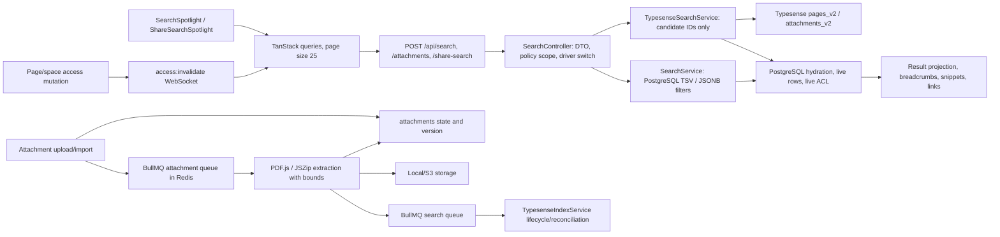

# G11 search, Typesense, and attachment content indexing audit - 2026-08-10

## 1. Verdict

**PASS WITH RISKS after fixes.** All eight reproducible G11 defects found in
the current `main` snapshot were fixed, committed independently, rebuilt into
the production image, and retested. No open G11 defect is known to expose a
forbidden page, database row, attachment, breadcrumb, or extracted snippet.

The remaining risks do not block the G11 code itself, but they prevent an
unqualified release-wide PASS:

- the full repository client suite has two pre-existing failures outside G11
  (`de-DE` is missing `Inactive`, and the AI administrator-guide key-count test
  expects 30 but finds 31); consequently `verify:full` and the serial
  `verify:release` wrapper cannot be green on this snapshot;
- the in-app browser exposed one browser context, so owner/member/anonymous UI
  checks were sequential; the same roles were exercised concurrently at the
  API layer;
- DOCX extraction and container structure were verified, but visual Word
  rendering was unavailable because LibreOffice is not installed;
- the browser download control and authorized/denied HTTP responses were
  verified, but the in-app browser did not expose a reliable completed-download
  event for the newly opened tab;
- Redis enqueue failure/recovery was covered by production-path unit tests and
  a real worker crash/restart, but a destructive live Redis outage was not run.

## 2. Fixed scope and history

### Repository coordinates

| Coordinate | Value |
| --- | --- |
| Release baseline | `v1.0.0` / `446f6ddd68d87b28d6d1e2add90c235495149970` |
| Fixed audit head | `e955a0c8d13be6384a08988f40b4331b9b686ce8` |
| Starting current-main HEAD | `af1b16dc87f6a49b7481abe72cf846cb92d7fb91` |
| Starting describe | `v1.0.0-149-gaf1b16dc` |
| Audit branch | `codex/g11-search-indexing` |
| Audit worktree | `D:\DevProjects\docmost-qa-G11` |
| Final tested branch image source | `ca49d4643a77e1d3a76ef44370ffbf4d28248e83` |
| Final image | `docmost-g11:ca49d464`, image ID `sha256:5956e1d4015a...` |
| Local-main G11 integration merge | `a02cfd814903ff7bd0f9960900103a85a6c24aac` (`v1.0.0-159-ga02cfd81`) |

The original checkout had only user-owned `graphify-out/*` modifications.
They were never staged, reverted, or merged. Graphify generated the same class
of worktree-local changes in the audit worktree; those files are excluded from
all G11 commits.

### Relevant history read

The primary range `v1.0.0^..e955a0c8` was inspected using both commit summaries
and diffs, not commit subjects alone. The directly relevant commits are:

| Commit | Audit use |
| --- | --- |
| `b3589edb` | Original hardening of candidate hydration, public projection, extraction fencing, bounds, CLI scoping, and pagination. |
| `11f9382e` | Prior search/indexing audit claims and evidence baseline; several claims were retested rather than accepted. |
| `71011f32` | Guillemet preservation in tsquery construction and its regression. |
| `0b1a6239` | Public-share policy and no-store boundary adjacent to search. |
| `1e339e65` | Page-template/embed integration that affects attachment/public ancestry. |

The complete earlier path history from
`0aeaa43112f5b9d808a9bf9b437db8247b39ff03..v1.0.0` was also read for the
baseline implementation.

The following `e955a0c8..af1b16dc` path-touching commits were reviewed before
making changes, so their fixes were preserved rather than reopened:

- `6f65ae26` recovery scheduling, Typesense reconciliation, and privacy-safe
  worker logging;
- `1dda5764` space-policy authorization on search and attachment routes;
- `3584bd67` live-embed/public attachment access;
- `e3d1dddf`, `b081e472`, and `4dd5f865` compiled CLI database loading and
  camel-case mapping;
- `d7dd6dd7` removal of stale search/attachment aliases;
- `2b310723` authenticated search-dialog semantics;
- `efbd7a1d`, `48c9d5e2`, and merge `e1f5ce4d` production-image and
  supply-chain changes.

### Files, contracts, migrations, and documentation inspected

- server: `apps/server/src/core/search/*`,
  `apps/server/src/core/attachment/{processors,services}/*`,
  `apps/server/src/cli/{cli.util,search-reindex}.ts`, queue constants and
  processors, WebSocket gateway, environment validation, page-access/share
  services, database repositories, and `Dockerfile`;
- client: all `apps/client/src/features/search/*`, search result URLs,
  TanStack query keys, WebSocket query subscription, API client, locale-backed
  labels, and shared accessible action controls;
- schema: `20260801T100000-attachment-content-index-status` and
  `20260807T140000-search-guillemet-indexing`, generated database types, page
  and attachment TSV/trigram indexes;
- contracts/docs: generated route inventory, API routing conventions,
  `ARCHITECTURE.md`, `README.md`, and
  `docs/search-and-attachment-indexing-audit-2026-08-07.md`;
- tests: every G11 unit cited below, route/security suites, and prior browser
  assertions. A prior seeded `slug_id` containing hyphens was found to violate
  the production slug generator contract. The old harness asserted navigation
  URL but not loaded page state; this was a test-fixture false positive, not a
  production routing defect. The isolated fixture was normalized in SQL only.

## 3. Implementation map

### Runtime switches and limits

- `SEARCH_DRIVER=database` is the default; `typesense` selects candidate
  retrieval only for unfiltered page search and attachment search. Label and
  TBD/TODO filters remain authoritative PostgreSQL queries.
- Typesense configuration uses `TYPESENSE_URL`, file-backed
  `TYPESENSE_API_KEY`, and `TYPESENSE_LOCALE`. Collections are
  `docmost_pages_v2` and `docmost_attachments_v2`.
- Typesense reads batches of 100 and caps a request scan at 10,000 candidates.
  The index reconciles every 15 minutes; scheduling retries every 60 seconds.
- PostgreSQL ACL-aware overfetch is capped at 100 rows. Pagination is ordered
  deterministically by rank, `updatedAt`, and `id`.
- Attachment extraction accepts PDF/DOCX, caps input at 50 MiB, normalized text
  at 1,000,000 characters, PDF pages at 500, work at 60 seconds, DOCX entries at
  10,000, one entry at 25 MiB, and total DOCX expansion at 100 MiB. Backfill
  batches are 100 with concurrency 2.
- States are `pending`, `processing`, `ready`, `skipped`, and `failed` with
  extractor version 1. Claims are fenced by ID, file path, state, and exact
  claim timestamp. Stale processing is reset after 120 seconds.
- The application has no server response cache for search. The client now
  treats search caches as ACL-sensitive, discards inactive entries, and
  refetches active entries on `access:invalidate`.
- Recovery is provided by startup/60-second attachment reconciliation,
  deduplicated BullMQ jobs, periodic Typesense reconciliation, and the scoped
  `search:reindex` CLI.
- Privacy-safe observability includes
  `attachment_content_recovery_failed`,
  `attachment_content_backfill_completed`,
  `attachment_content_extraction_terminal`,
  `attachment_search_enqueue_failed_after_extraction`,
  `typesense_initialization_failed`,
  `typesense_reconciliation_schedule_failed`, and
  `typesense_reconciliation_completed`. Logs carry codes/counts, not extracted
  text, filenames, tokens, or raw provider payloads.

## 4. Environment and external tools

| Tool | Provenance and exact version | Isolation and data |
| --- | --- | --- |
| Docmost | Local branch image `docmost-g11:ca49d464` | Separate Compose project, ports 3211/3212, current production Dockerfile. |
| Typesense | Official `typesense/typesense:30.2@sha256:610f2d34b1f93d00762869da2c67736775e5798d19a2c8b91b014b8a0cc1e110`; server reports 30.2 | Local-only port 38111; synthetic corpus only; CORS disabled; synthetic key stored as a Docker secret. Official repository/release and GPL license were reviewed. |
| PostgreSQL | `postgres:18-alpine@sha256:9a8afca54e7861fd90fab5fdf4c42477a6b1cb7d293595148e674e0a3181de15`; server 18.4 | Dedicated volume and port 35411. |
| Redis | `redis:8-alpine@sha256:978f0e01593e65eed801f2402944efcd936d43b5027e4908a7897baf88ed6241`; server 8.10.0 | Dedicated volume and port 36411. |
| Browser | Codex in-app Chromium automation | One local context; no SaaS upload; network instrumentation did not persist request headers. |
| PDF | Poppler renderer plus repository PDF.js runtime | Locally generated deterministic fixtures only. |
| DOCX | Locally generated Open XML fixtures, JSZip/yauzl structural inspection | No document left the host; LibreOffice was unavailable. |
| Host | Docker Desktop 29.5.3, Node 24.16.0, pnpm 10.4.0 | Windows host; all service ports bound to 127.0.0.1. |

No OCR, SaaS search, remote document processor, or external MCP server was
used. Typesense was chosen because it is the integration implemented by this
repository and because an official, exact-version local image covers failure,
latency, and stale-index scenarios without exporting source or fixtures.

## 5. Coverage matrix

| Requirement/scenario | Static/unit | Integration/fault/security | Browser | Result and evidence |
| --- | --- | --- | --- | --- |
| PostgreSQL vs Typesense corpus | Driver/controller and hydration read | 12 query classes plus attachment sets compared by sorted permitted IDs | Representative Typesense UI queries | PASS; zero permitted-set diffs in `http-database.json` and `http-typesense.json`. |
| Plain, Unicode, Russian, quotes/guillemets, punctuation, exact fragments | tsquery and DTO regressions | Both live backends returned expected IDs; unsupported exact Russian stemming was not overclaimed | Unicode/highlight inspected | PASS. |
| Labels, TBD, TODO, empty/space/long | JSONB parameter regression and DTO bounds | Filters returned one expected page; invalid query shapes returned 400 | Label-only and tag-only flows passed; public whitespace sent zero requests after fix | PASS. |
| Pagination and stale responses | 25-item paging helpers and query-key tests | 32 deterministic pages, no duplicate/omission | 25 then 32 after Load more; rapid query/filter change retained final response only | PASS; `01-typesense-pagination-25.png`. |
| Breadcrumbs and links | Breadcrumb and result-item tests | Page, database, row, attachment, moved/deleted/restored states | Canonical page/database-row links loaded after fixture correction | PASS; old URL-only harness classified as false-positive coverage. |
| PDF/DOCX state matrix and limits | extraction, queue, timeout, storage race, version tests | normal/empty/encrypted/corrupt/oversized/missing/501-page fixtures; real delete-during-extraction | Attachment names/snippets shown only to permitted user | PASS; state table below and rendered PDF images. |
| Claim race, crash, retry, version, CLI | atomic-claim and bootstrap tests | Real worker kill during 501-page extraction; stale claim reset and completed; old version reprocessed; CLI scoped rebuild/re-extract | N/A | PASS. |
| ACL/public share/stale forbidden candidate | controller/service and public projection tests | Hidden and denied candidates physically present in Typesense but removed after live hydration; download 200/403; public no-store | Member direct URL denied; anonymous share limited to two-page subtree; live revoke removed active result in 1.2 s | PASS; `02`, `03`, `04` screenshots. |
| Typesense unavailable/slow/out-of-sync | service failure tests | Stop => 503 empty; pause => 503 after 32.264 s; stale move/delete/restore and scoped ghost cleanup; recovery => 200 | No stale forbidden result rendered | PASS; `typesense-paused.txt`. |
| Snippet/download confidentiality | sanitizer, projection, access-service tests | Forbidden canaries absent from responses; authorized download 200, denied 403 | DOM had one `mark`, no `img`, `script`, or `onerror`; 32x32 named download actions | PASS; `05-final-attachment-result.png`. |
| Queue/restart behavior | enqueue-failure and recovery tests | Real worker crash, app/collab restart healthy, queue drained; deletion while processing published no text/index job | Reload/reconnect search passed with zero console errors/warnings/unhandled rejections | PASS WITH RISK: no destructive live Redis stop. |

### Attachment fixture results

| Fixture | Final state/evidence |
| --- | --- |
| Normal PDF | `ready`, version 1, 186 chars; two pages rendered and visually inspected. |
| Normal DOCX | `ready`, version 1, 155 chars; three paragraphs/153 source chars structurally verified. |
| Empty PDF / DOCX | `ready`, empty normalized text. |
| Encrypted PDF | `skipped/encrypted_document`. |
| Corrupt PDF / DOCX | `failed/unreadable_document`. |
| Oversized entry / total expansion | `failed/archive_limits_exceeded`. |
| Unsupported TXT | not queued; direct service branch marks `skipped/unsupported_type`. |
| Missing object | `skipped/storage_missing`. |
| Object disappears between exists/read | `pending/storage_unavailable` and bounded queue retry. |
| 501-page PDF | `ready`, 49,390 chars, only first 500 pages indexed. |
| Worker killed in processing | stale `processing` recovered to `pending`, then `ready` version 1. |
| Row soft-deleted during extraction | completion fence wrote no text and enqueued no candidate; test row removed afterward. |
| Existing `ready`, version 0 | bootstrap/backfill reclaimed and finished at version 1. |

## 6. Command and check log

Read-only `git log/show/diff/rg`, Docker inspection, SQL selects, and browser DOM
inspection all exited successfully unless a result is explicitly called out
below. Material executable checks are listed here.

| Command/check | Exit | Result |
| --- | ---: | --- |
| Initial `git status --short; git rev-parse HEAD; git describe --tags --always` | 0 | User-owned `graphify-out/*`; `af1b16dc`; `v1.0.0-149-gaf1b16dc`. |
| Initial targeted server/client tests before worktree dependency availability | 1 | Baseline harness failure: local `tsx`/modules unavailable; no product assertion made. |
| `docker build -t docmost-g11:ca49d464 .` | 0 | Exact final production image built; PDF runtime imports verified in Dockerfile. |
| Isolated Compose start/rebuild in database and Typesense modes | 0 | App and collab healthy on exact image; final mode Typesense. |
| `node data/g11-audit/run_http_matrix.mjs` in database mode | 0 | Full HTTP matrix passed. |
| Same HTTP matrix in Typesense mode | 0 | Full HTTP matrix passed. |
| Node sorted-ID comparison | 0 | 12 query classes and five attachment groups: zero permitted-set diffs. |
| Typesense stop / start | 0 | 503 fail-closed, then 200 recovery. |
| Typesense pause / unpause | 0 | 503 after 32.264 s, no candidate payload, then recovery. |
| Real app kill/restart during 501-page extraction | 0 | Stuck claim recovered and extraction completed. |
| Real soft-delete during 501-page extraction | 0 | No text committed; row cleaned after assertion. |
| `corepack pnpm --filter ./apps/server search:reindex -- --help` | 0 | Help printed without service connection. |
| Invalid workspace / retry-without-reextract CLI invocations | 1 each | Expected argument rejection, before service access. |
| Valid scoped Typesense rebuild/reextract/retry matrix | 0 | Correct workspace/entity jobs and state resets; cross-workspace ghost retained, then cleaned separately. |
| `corepack pnpm --filter ./apps/server test -- --runInBand src/core/search attachment-content` | 0 | 10 suites, 55 tests. |
| Requested client command with extra `--` | 1 | Vitest interpreted the selector broadly; 602/604 passed and reproduced the two unrelated baseline failures. |
| `corepack pnpm --filter ./apps/client exec vitest run src/features/search` | 0 | 4 files, 23 tests. |
| `corepack pnpm run test:security` | 0 | Server 784 plus client 74 tests. |
| `corepack pnpm verify:full` | 1 | Contracts, architecture, env, build, lint, server 1706, and client build passed; stopped on the two unrelated client tests (602/604). |
| `routes:inventory:check`, `check:comments:en`, `test:text-contracts`, `check:rag-docs` | 0 | 311 routes current; language/text/RAG contracts current. |
| `check:audit-exceptions` | 0 | One declared dependency exception validated. |
| `test:editor-ext` | 0 | 62 tests. |
| `test:rag-sync:contract` | 0 | Three protocol plus 158 server tests. |
| `test:mcp:audit-client` | 0 | One protocol/redaction test. |
| `pnpm audit --prod --audit-level high` | 0 | One high finding, explicitly ignored by the repository exception contract. |
| Evidence sanitizer and scanner | 0 | Three exact secrets/canaries checked; clean, zero findings. |
| Container logs + all 47 isolated Redis keys + DB credential-pattern counts | 0 | Zero credential matches in logs/Redis/pages/attachment text. One intentional denied attachment canary row remained in DB and never appeared in a denied response. |

`verify:release` was not rerun as a serial wrapper because its first command is
the already-reproduced failing `verify:full`. All non-browser release substeps
after that gate that were relevant and locally callable were run separately as
shown. The G11 browser matrix replaced unrelated AI/editor browser suites; it
ran against the exact rebuilt production image rather than a development
bundle.

## 7. Findings

| ID | Severity | Component | Reproducibility and actual behavior | Root cause | Status / fix commit |
| --- | --- | --- | --- | --- | --- |
| G11-01 | Medium | Attachment recovery | A `ready` version-0 attachment remained stale across startup/backfill. | Recovery selected only `pending`; claims rejected `ready` even when version mismatched. | Fixed / `51f691af`. |
| G11-02 | Medium | Recovery CLI | `--reextract-attachments` queued work but did not reset ready/skipped rows; most files were no-ops. Help also required service env before printing. | CLI only reset failed rows when `--retry-failed` was present. | Fixed / `265b95f8`. |
| G11-03 | High | Production PDF ingestion | The production image could build without the optional native canvas binding and every PDF import then failed at runtime. | pnpm platform-optional dependency was not verified in either dependency or final image layer. | Fixed / `4e2141db`. |
| G11-04 | Medium | PostgreSQL tag filter | Label-less TBD/TODO filter returned 500 with a polymorphic `jsonb_build_object` parameter error. | The bound tag had unknown SQL type in the JSONPath variables object. | Fixed / `c49a63ac`. |
| G11-05 | Low | Search DTO | Authenticated whitespace-only query passed validation and returned the newest authorized pages instead of 400. | Validation trimmed only in its predicate, not in the transformed DTO value. | Fixed / `175953bd`. |
| G11-06 | Low | Search result accessibility | Attachment download actions measured 28x28, below the project's 32px action target. | Default Mantine action size was used. | Fixed / `f35408e5`. |
| G11-07 | High | ACL revocation / client cache | After page access was revoked, an already-open search retained the forbidden title/snippet until cache staleness or a manual action. | Search queries had a five-minute cache and access mutations emitted no search-cache invalidation. | Fixed / `bd9061ce`. |
| G11-08 | Low | Public-share search UX | Whitespace input sent a guaranteed-400 request and displayed “No results”; the public dialog had no accessible name. | Client enablement used string truthiness and the public Spotlight lacked dialog semantics. | Fixed / `ca49d464`. |

All findings reproduced on `af1b16dc`, have production-code fixes and targeted
regressions, and were rechecked on `ca49d464`. None is left in “unfixed” or
“not reproduced” status.

## 8. Finding evidence and impact

### G11-01 - extraction version recovery

1. Set a valid PDF row to `ready`, `content_index_version=0`.
2. Restart or run the ordinary workspace backfill.
3. Before the fix the row was never selected; after the fix it atomically
   moved through `processing` to `ready/version=1`.

The impact is stale or policy-obsolete extracted text after a future extractor
version bump. The fix expands only the existing version predicate and keeps all
claim fencing. Queue enqueue now occurs after the DB transaction and is
best-effort because PostgreSQL is already authoritative; the 15-minute
Typesense reconciliation repairs a missed index job.

### G11-02 - ineffective recovery CLI

1. Invoke a workspace-scoped re-extract with ready/skipped fixtures.
2. Before the fix their state did not change and the queued worker skipped
   them; after the fix supported rows reset to pending with timestamps/version
   cleared.
3. `--retry-failed` adds failed rows, remains dependent on re-extract, and
   pages-only re-extract remains rejected.

The change neither alters schema nor public API. Rollback is the single commit;
operators can still use the same CLI syntax.

### G11-03 - missing PDF runtime binding

The failure was reproduced in the production-layer dependency graph, not in a
host development install. The Dockerfile now imports `@napi-rs/canvas` in the
production dependency layer and imports both PDF.js and the binding again in
the final image. A missing architecture-specific optional package therefore
fails the build, rather than marking every customer PDF unreadable after
deployment. Rollback would restore the silent failure and is not recommended.

### G11-04 - untyped tag JSONPath parameter

The request used no text query, only `tag=TBD` or `tag=TODO`. PostgreSQL could
not infer the bound parameter accepted by `jsonb_build_object`. Adding
`::text` preserves the public DTO and query plan while making the SQL type
deterministic. Both tags passed on PostgreSQL and on the Typesense deployment
because filtered page searches intentionally route through PostgreSQL.

### G11-05 - whitespace query contract

Before the fix, three spaces satisfied `IsNotEmpty`, then the service treated
the trimmed term as absent and returned recent authorized pages. The DTO now
transforms first, so unfiltered whitespace is 400 while whitespace plus a
label/tag remains a valid filter-only search. Empty and >512-character queries
also return 400.

### G11-06 - attachment action target

The real browser measured 28x28 before the fix and exactly 32x32 after it. The
control retains `aria-label="Download attachment"`; result-row navigation and
download click propagation remain independently tested.

### G11-07 - live ACL revocation

1. Member opened a query and saw the private title and snippet while access was
   allowed.
2. Owner closed the page through the real access API.
3. Before the fix the result stayed visible. After the fix the existing
   workspace visibility event also emitted `access:invalidate`; active search
   refetched and showed “No results” in 1.2 seconds without reload.
4. Server-side direct search and direct page URL were denied throughout the
   revoked state.

The event carries no page ID, title, user ID, or content. The client invalidates
all access-sensitive search roots because a subtree/group/space change can
affect more than one page. Active queries refetch; inactive results are removed.
This is intentionally broader than rank/freshness lifecycle invalidation.

### G11-08 - public-search input and semantics

Anonymous whitespace now keeps the localized “Start typing” state and emits
zero `/api/search/share-search` requests. Non-empty search still returns only
the shared root and child with `Cache-Control: private, no-store`; hidden and
cross-space terms return none. The dialog resolves with accessible name
the localized Search label. Public search uses zero stale/gc time and refetch-on-mount/focus
to avoid carrying share-access state between opens.

## 9. Verified no-defect scenarios

- PostgreSQL and Typesense returned identical permitted result ID sets for
  plain, Unicode, guillemet, punctuation, exact, Russian prefix/morphology,
  label, TBD, TODO, database, database-row, and attachment queries. Ranking
  exactness was deliberately not compared.
- 32 results paged 25 + 7 without duplicates or omissions; changing queries
  and filters during a request did not paint a stale response.
- Page/database/database-row links and breadcrumbs used current DB state after
  move. Deleted candidates were removed, restored candidates returned after
  indexing, and a stale Typesense title never overrode hydrated PostgreSQL
  title/breadcrumb data.
- Typesense held hidden/denied synthetic candidates, yet member responses,
  public responses, and browser DOM contained neither IDs nor canary snippets.
- Workspace-scoped rebuild removed a scoped ghost without deleting the other
  workspace's ghost; the latter was then cleaned explicitly.
- Typesense stop/slow failure returned 503 with no candidates; restart
  recovered without a full startup flush.
- Public share returned exactly the root and allowed child, omitted the private
  ancestor and all space/user/database metadata, and used no-store headers.
- Authorized attachment download returned 200/application-pdf; denied returned
  403. Extracted text is exposed only as an authorized search snippet, never as
  a download metadata field.
- Hostile highlight content produced only sanitizer-approved `<mark>` markup;
  DOM inspection found no executable nodes or attributes.
- App/collab restart, real worker crash, claim race, failed retry, version
  re-extraction, storage disappearance, and delete-during-extraction behaved as
  documented.
- Final authenticated member and anonymous flows recorded zero console errors,
  warnings, and unhandled rejections.

## 10. Fix and rollout report

| Fix | Production files | Added/updated tests | Retest and acceptance |
| --- | --- | --- | --- |
| Version recovery and queue boundary | `attachment-content.service.ts` | service and bootstrap suites | Old ready version reprocessed; enqueue failure leaves DB ready and reconciliation-capable. |
| Effective re-extraction CLI | `search-reindex.ts` | exercised live plus CLI validation | Ready/skipped/optional failed rows reset only in scope; exact job payload verified. |
| PDF image fail-fast | `Dockerfile` | build-time import checks | Exact production image built and extracted normal/501-page PDFs. |
| Typed tag JSONPath | `search.service.ts` | search service regression | TBD/TODO filter-only searches 200 with expected page. |
| Trimmed query DTO | `search.dto.ts` | DTO boundary regressions | spaces 400; filter-only spaces valid; normal query trimmed. |
| 32px download action | result component | result-item regression | Browser 32x32 and named action. |
| ACL-sensitive cache invalidation | gateway, query subscription, unified cache helper | gateway, subscription, hook tests | Revoked active result gone in 1.2 s; inactive caches removed. |
| Public share input hardening | share Spotlight and query helpers | query tests | No whitespace request; dialog named; scoped result unchanged. |

There are no schema, migration, or public contract changes in these fixes.
Rollout uses the ordinary application image and no feature flag. Rollback is
commit-granular, but rolling back G11-07 would reintroduce a revocation window
and rolling back G11-03 would restore silent image incompatibility. Existing
structured log events are sufficient to observe recovery, reconciliation, and
terminal extraction codes; no sensitive values were added.

Acceptance criteria are: exact image builds; both backends produce the same
permitted sets; all G11 tests/security checks pass; denied candidates and
snippets never cross live ACL/public scope; state recovery converges; active UI
revocation removes cached content; and evidence scan remains clean. All were
met on the tested branch.

## 11. Evidence, commits, and cleanup

Evidence root (sanitized, intentionally git-ignored):
`D:\DevProjects\docmost-qa-G11\data\g11-audit\evidence`.

Key files:

- `http-database.json` and `http-typesense.json` - final backend matrices;
- `typesense-paused.txt` - bounded slow/unavailable behavior;
- `browser/01-typesense-pagination-25.png` - first page and Load more;
- `browser/02-member-denied-page.png` - direct denied URL;
- `browser/03-live-acl-revoke-no-results.png` - active result removed after
  access revocation;
- `browser/04-public-share-scoped-search.png` - anonymous scoped results;
- `browser/05-final-attachment-result.png` - final attachment results,
  snippets, filters, and named download controls;
- `pdf-render/normal-1.png` and `normal-2.png` - rendered normal PDF;
- `trace-sanitization.json` and `secret-scan.json` - zero replacements needed,
  clean scan across three exact secret/canary values.

Production commits:

1. `51f691afd29d7067d58c199d70f6feb6b5ca909b` - extraction versions;
2. `265b95f8` - effective CLI recovery;
3. `4e2141db` - PDF runtime binding verification;
4. `c49a63ac` - typed tag filters;
5. `175953bd` - whitespace contract;
6. `f35408e5` - download target;
7. `bd9061ce` - ACL cache invalidation;
8. `ca49d4643a77e1d3a76ef44370ffbf4d28248e83` - public share input/a11y.

The deterministic fixture generator, SQL seed, Compose override, HTTP harness,
synthetic secrets, and cookie file were test-only and never committed. The
cookie/harness files are removed after final evidence generation. The isolated
Compose project and volumes are removed after merge verification. No push, PR,
tag, release, real credential, or production data mutation was performed.
